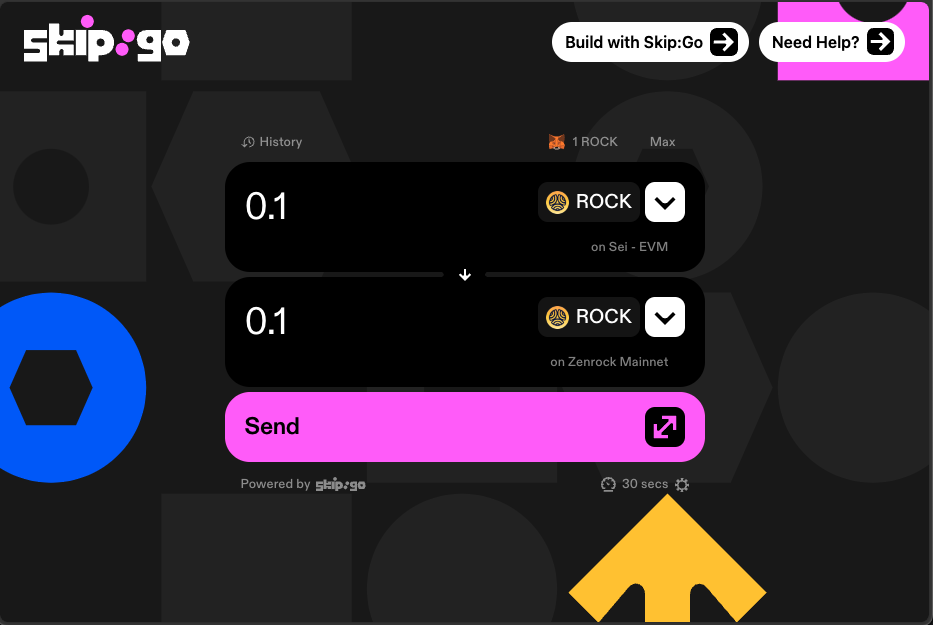
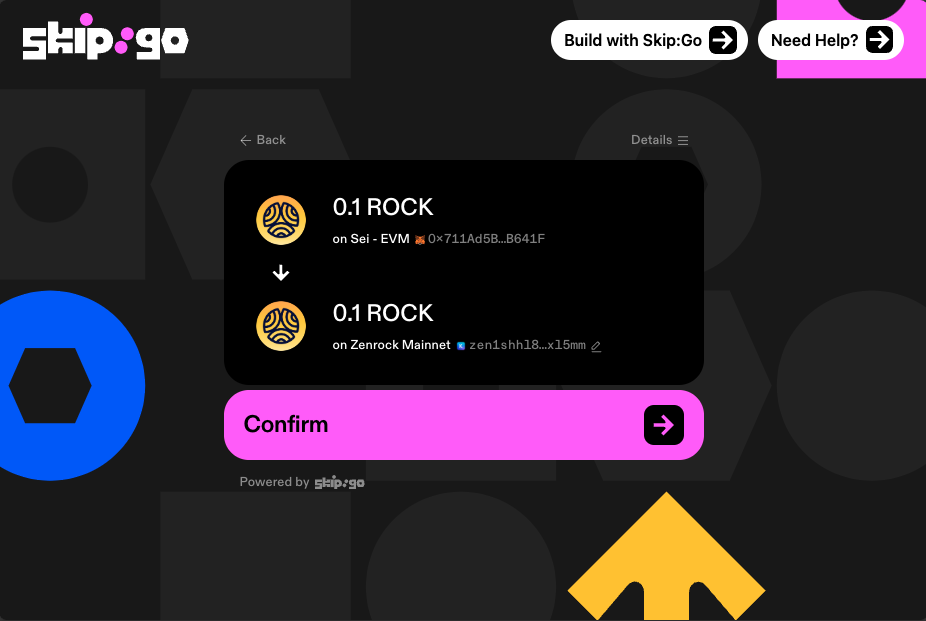
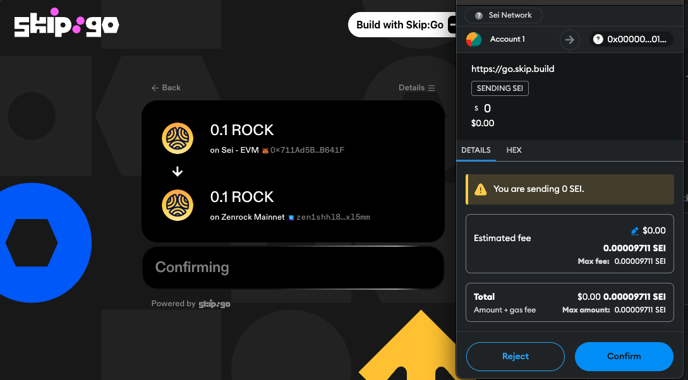
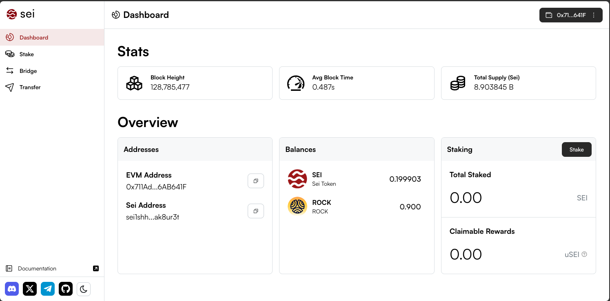

1. First head to [https://go.skip.build/](https://go.skip.build/). Here select ROCK from SEI EVM as source and Zenrock Mainnet as destination. Make sure that Skip displays the same balance as in the previous step. Enter the amount you want to transfer.

2. Check the destination address, it should be the same as in your Keplr Wallet and the wallet on app.sei.io.

3. Confirm the transaction in Metamask and wait until it has been processed.

4. After it has been processed the changes are visible on [app.sei.io](http://app.sei.io) and in your wallet.

