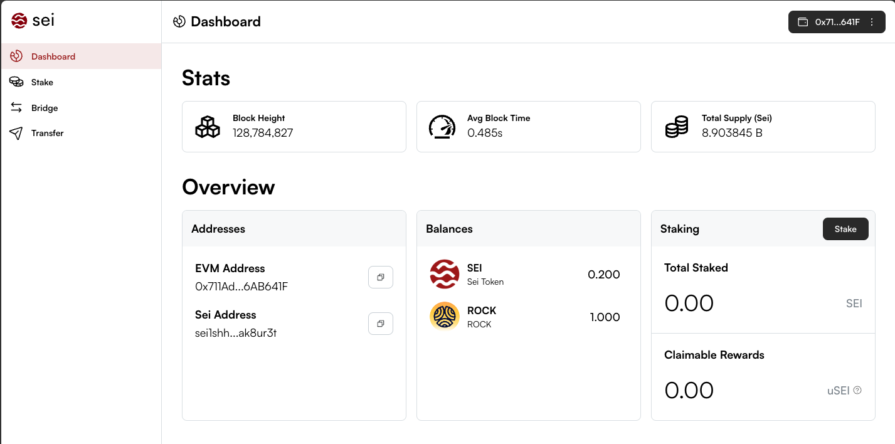

Welcome to the documentation for transferring ROCK between Sei and zrChain. This page shows the process from using Metamask as well as Keplr using [app.sei.io](http://app.sei.io) webpage and further highlights common errors. 

To follow this guide you need to have some SEI to cover transaction fees as well as ROCK (either Sei EVM or on Sei).

For simplicity we recommend to use Metamask to setup your Sei account as this will always derive the correct Sei and Zenrock addresses. If you have a Keplr wallet, please follow the Keplr setup instructions below.

## Setup from Metamask

1. **Import your Metamask private key into Keplr:** The Metamask account that holds some ROCK EVM should be added to the Keplr wallet that you need to interact with zrChain. You can do this by following these steps:

   - `Metamask: Account Details → Show private key → COPY`
   - `Keplr: Import an existing wallet → Use recovery phrase or private key → Select private key → Paste private key → Name it and select a password → Select ROCK Mainnet, Sei, Sei EVM in Keplr.`

2. Go to [app.sei.io](http://app.sei.io) and click on “Connect Wallet”.

3. Choose Metamask and confirm in the Metamask popup. Switch to “Sei Network” and add the chain to your Metamask if not already set. Confirm the switch.

4. Complete the sign-in request. This is not a transaction but just proves that you control the address you connect the page with.

5. **Link addresses:** You need to associate a native Sei address with your 0x address. Verify the captcha and click on “link addresses”. If you get an error, then reload the page. Your Sei address should match the Sei address in Keplr.

6. Ensure the accounts are funded with ROCK EVM and Sei EVM. The funds will appear as SEI and ROCK respectively.

## Setup from Keplr
