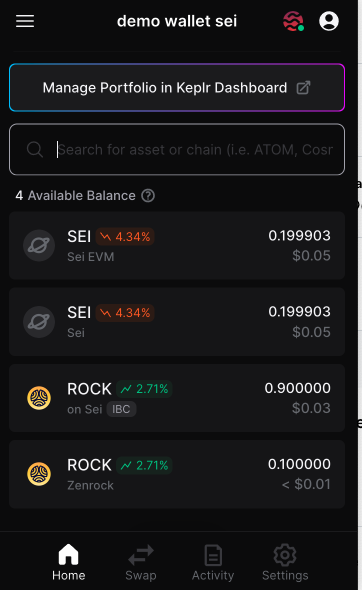
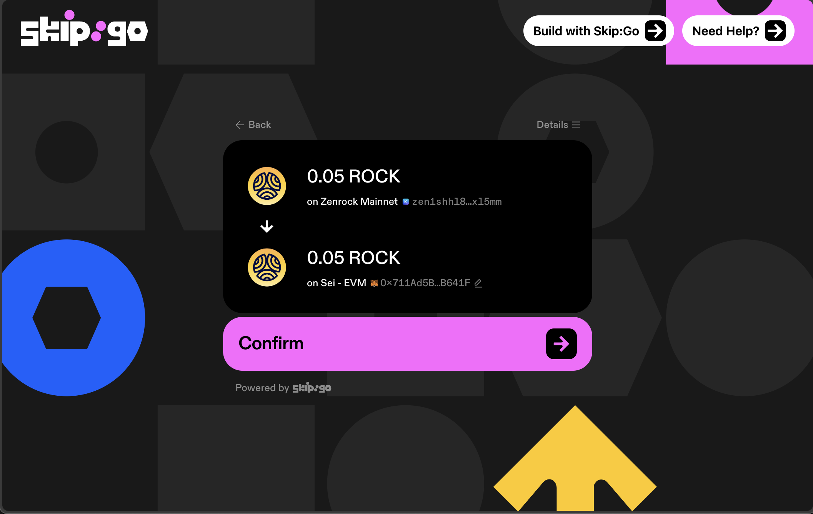
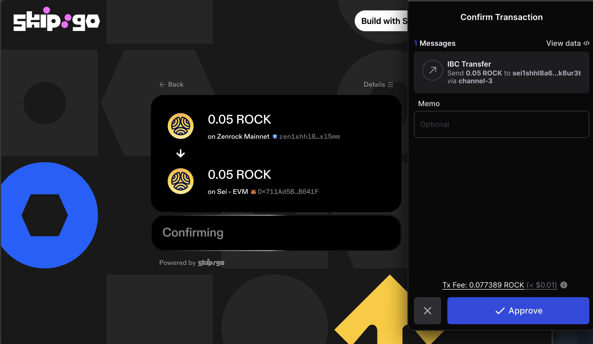
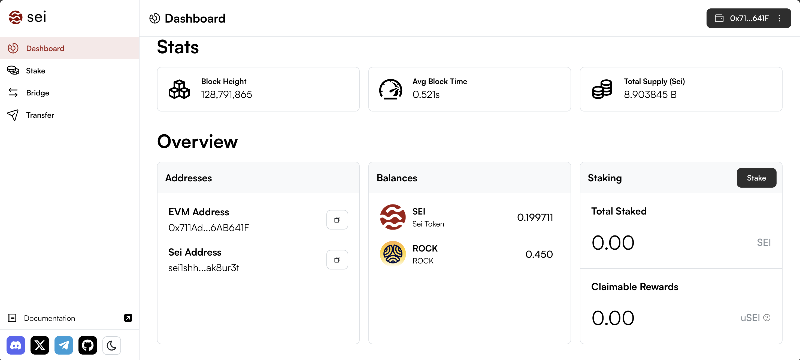

## Steps to Transfer ROCK from Zenrock Mainnet to Sei EVM

1. **Ensure you have ROCK on Zenrock Mainnet.** You can see this in the Keplr wallet under ‘available balances’. 

2. **Initiate a transfer:** Head to [Skip Build](https://go.skip.build/) to initiate a transfer from ROCK to Sei EVM.Select the desired amount to send and confirm the addresses match with the ones from [Sei App](https://app.sei.io).

3. **Confirm the IBC transaction:** In Keplr, wait momentarily until the transaction has succeeded on Skip and Zenrock.

4. **Verify funds:** Check the balances have changed on [Sei App](https://app.sei.io) to confirm funds have arrived on Sei.

