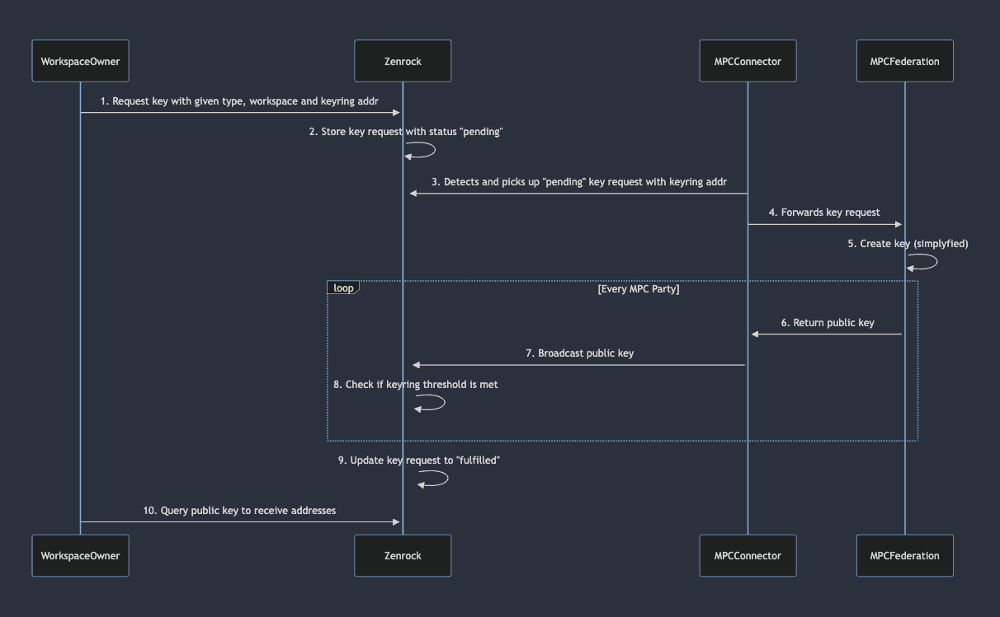

This sequence diagram follows and explains each step in the process of requesting 
and generating a key from a keyring service. 

1. ***Workspace Owner Initiates Key Request***: The process begins with an owner of a workspace sending a key request to Zenrock. This request includes the [key type](../zrChain/treasury.md#supported-keys), [workspace](../zrChain/identity.md#workspaces), and the [keyring](../zrChain/identity.md#keyrings) address. A fee to create the key according to the fee model inside the keyring is being charged.
2. ***Zenrock Stores Request***: Upon receiving the request, Zenrock verifies and stores the request and marks the status as "pending". This indicates that the key request is acknowledged but not yet processed by the keyring yet.
3. ***MPC Connector Detects Pending Request***: The MPC Connector monitors for any pending key requests. When it detects the request with the specified keyring address, it picks it up for further processing.
4. ***MPC Connector Forwards Request***: The MPC Connector then forwards the key request to the MPC Federation, which is responsible for generating the key.
5. ***MPC Federation Creates Key***: The MPC Federation begins the process of the key creation. This step is simplified in the diagram, but typically involves complex cryptographic operations to ensure the security and integrity of the key. The parties within the MPC Federation exchange information with each other, with the result of a valid key pair with a type according to the request. 
6. ***Public Key Result***: Once a key pair is generated, the individual parties of the MPC federation forward their result to their individual MPC connector with their individual signature. 
7. ***Public Key Broadcast***: Using the signature from the individual MPC party, the MPC Connector broadcasts the response for every party individually to Zenrock.
8. ***Zenrock Checks Threshold***: When the key request response from the MPCs are broadcasted, Zenrock then verifies if the keyring threshold is met, which is defined in the keyring object, is fulfilled or rejected. 
9. ***Request Fulfillment***: Once the threshold criteria are satisfied, Zenrock updates the status of the key request from "pending" to "fulfilled" or "rejected", indicating the successful creation of the public key or the rejection of the request. 
10. ***Key Derivation in Query***: If the request was successfully fulfilled, the user can query the public key and indicating which address format it should be derived into.