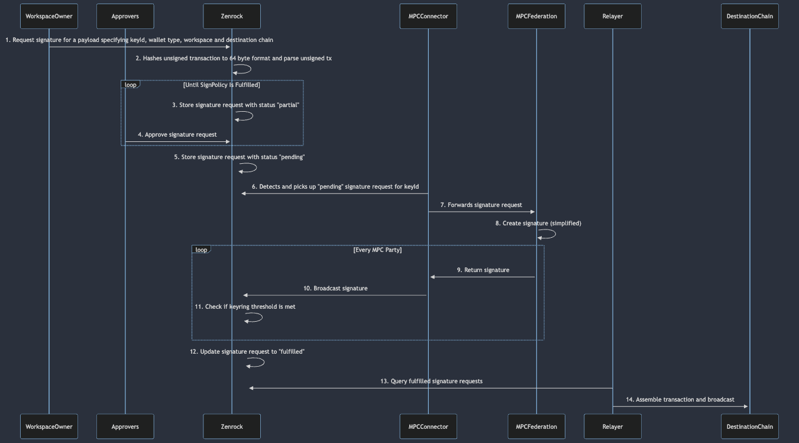

This sequence diagram follows and explains each step in the process of requesting- 
and generating a signature for a transaction. 
The transaction signature request is a subtype of a general signature request, therefore the 
overall process has many similarities to the [signature request process](signRequests.md). 
However, the request differs with additional wallet type and destination chain- or prefix definition, 

1. ***Workspace Owner Initiates Transaction Signature Request***: The process starts with an owner of a workspace sending a transaction signature request for a specific key inside the workspace to Zenrock, indicating the wallet type and the destination chain.
2. ***Parsing and Formatting Signature Request***: When the unsigned transaction is broadcasted to Zenrock, the unsigned transaction will get parsed to check for the transaction details. Depending on the workspace's signing policy, a different policy may be in effect. For example, if the transaction transfers over a significant amount of the underlying coin.
3. ***Storing of Signature Request***: Zenrock stores this request with a status that depends on the sign policy within the workspace. If other approvers are required the status will be "partial". This indicates that the signature process requires approval from other workspace owners. If no other approvers are required, the status will be changed to "pending", indicating that the MPC can start processing the request. 
4. ***Approval by Required Approvers***: If additional approvals are required, eligible Approvers receive an action to respond to the signature request and approve or reject it. This step is repeated until all required approvals or rejections are obtained, ensuring that the signPolicy is satisfied.
5. ***Updating Request Status to Pending***: Once all approvals are received to satisfy the signPolicy, Zenrock updates the status of the signature request to "pending", indicating it is ready for further processing.
6. ***MPC Connector Detects Pending Request***: Similar to the key request process, the MPC Connector monitors for any pending signature requests for keys associated with the respective keyring. 
7. ***Forwarding Request to MPC Federation***: The MPC Connector forwards the signature request to the MPC Federation, which will handle the cryptographic signing process.
8. ***MPC Federation Creates Signature***: The MPC Federation starts creating the signature. This step is simplified in the diagram, but typically involves complex cryptographic operations. The parties within the MPC Federation exchange information with each other, with the result of a valid signature in respect to the signature request. 
9. ***Signature Request Result***: Once a signature is generated, the individual parties of the MPC federation forward their result to their individual MPC connector with their individual signature.
10. ***Broadcasting of Signature***: Using the signature from the individual MPC party, the MPC Connector broadcasts the response for every party individually to Zenrock.
11. ***Zenrock Checks Threshold***: When the signature request response from the MPCs are broadcasted, Zenrock then verifies if the keyring threshold is met, which is defined in the keyring object, is fulfilled or rejected. 
12. ***Request Fulfillment***: Once the threshold criteria are satisfied, Zenrock updates the status of the signature request from "pending" to "fulfilled" or "rejected", indicating the successful creation of the signature or the rejection of the request.
13. ***Querying Signature Request***: If the request was successfully fulfilled, the user can query the complete signature request and can use it for its service who requested the response.
14. ***Relayer Broadcasts Tx***: Once the signing process is complete, Zenrock now holds the unsigned transaction and the signature. A custom relayer picks up both elements and assembles it into a valid signed transaction. This signed transaction is then broadcasted to an RPC node of the destination chain as indicated in the request.