In this next step, we will use custom policies. We will add a new member and update our sign policy before making a signature request. 

1. ***Create New Account***

Create a new account in your Keplr wallet. Open `Keplr` —> `Account icon on the top right` —> `Add Wallet`. Save the seed phrase somewhere secure and copy the Zenrock account address starting with “zen1…". If you switch accounts within the same browser, we recommend to reload the page after the account has changed. Alternatively, ask to do it with a companion on different devices.

2. ***Add Member to Workspace***

Switch your account back to the original account and go to the “Members” tab in the Workspace view. Here, add the address you have copied from the second account and add it to the Workspace. This is an on-chain transaction that needs to be published to zrChain. The second address will be shown on the members list of the Workspace. 

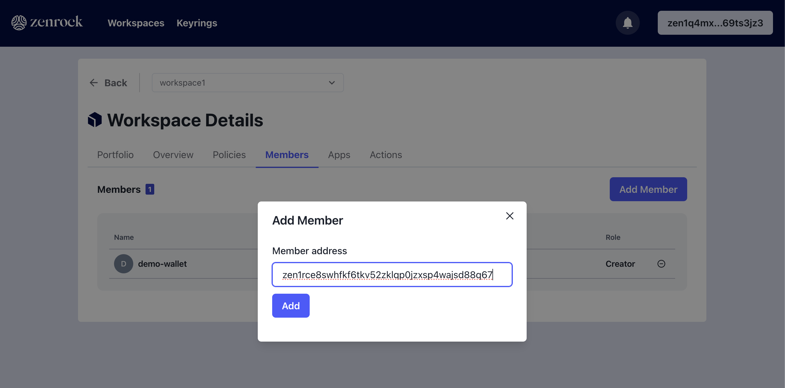

***Optional: Request your First Key***: If the workspace has no keys yet, request a key to follow this guide. 

3. ***Create new Policy***

Create a new policy by navigating to the Policy tab. Chose "Create Policy" button which prompts a modal where you can enter a name for the policy. In the next step chose the participants from the dropdown and give it an alias. In the case following this guide, I want both parties to approve a request, therefore, both participants are added and after clicking on "next" both are required to approve under this policy. On the summary page click "Create Policy" and sign the transaction.

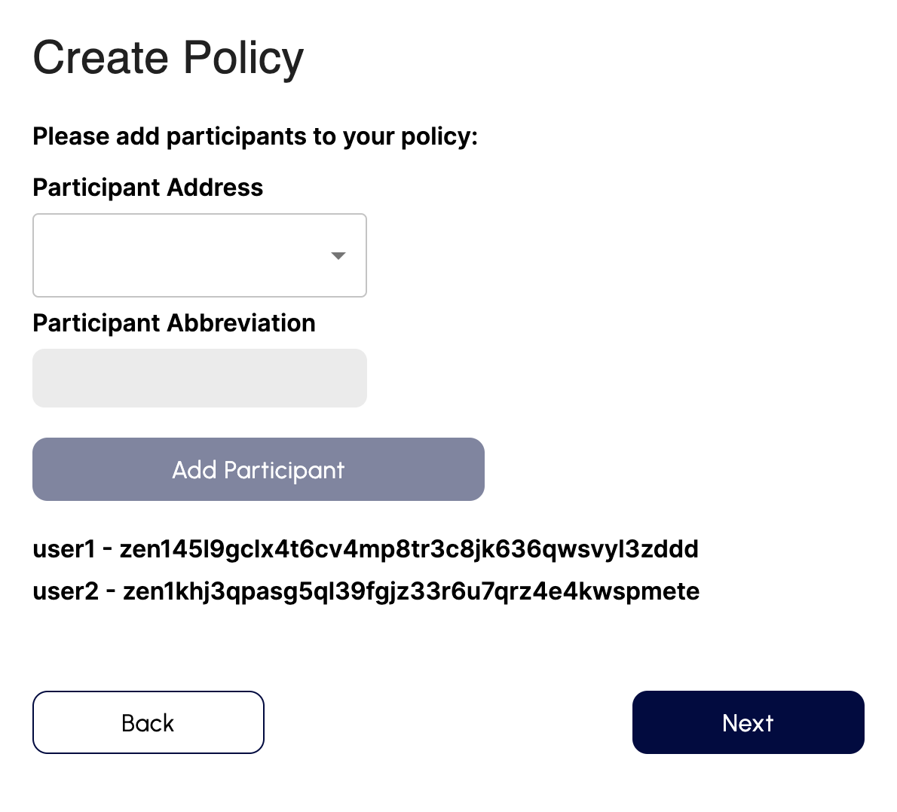

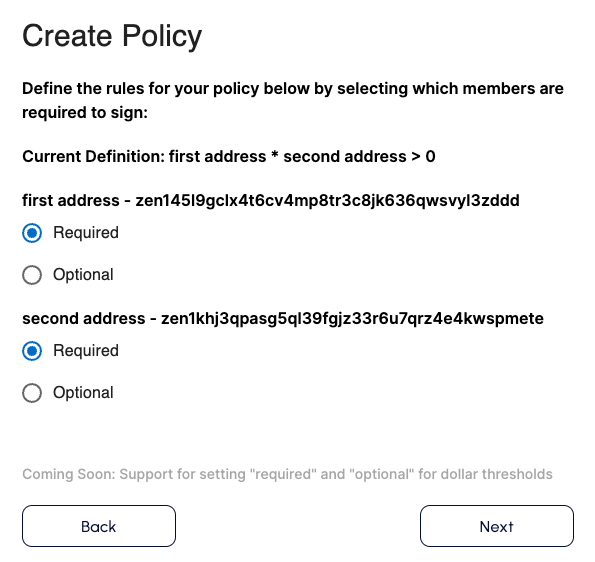

Once the policy is created, set it as an active policy and select ***Set as Sign Policy*** by clicking on the button. This policy will automatically show up on the ***available policies*** section in the workspace. Approve the transaction in Keplr.

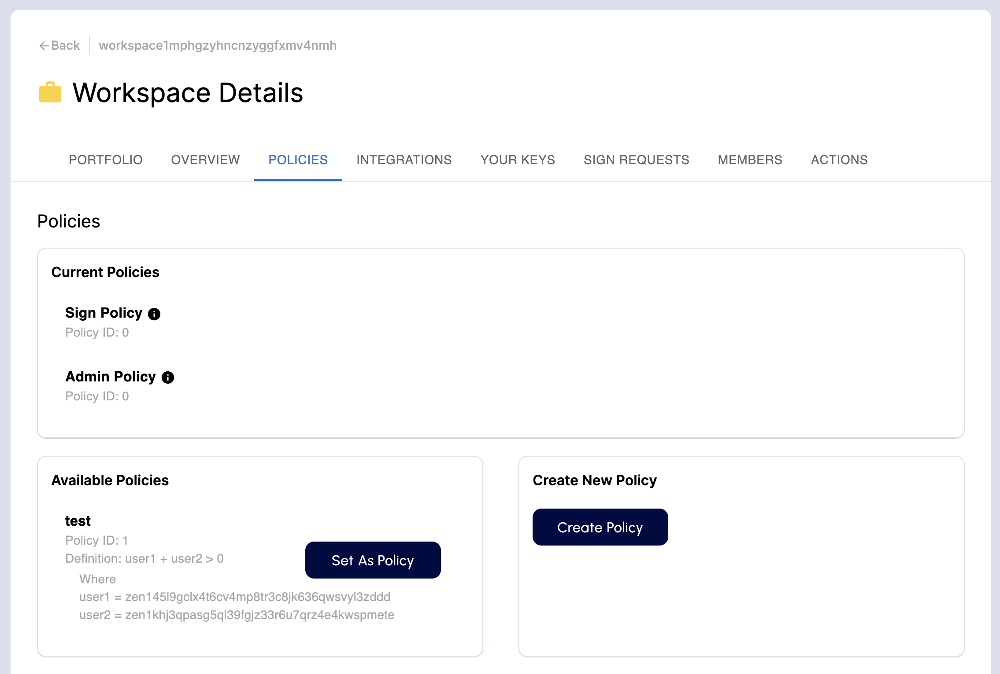

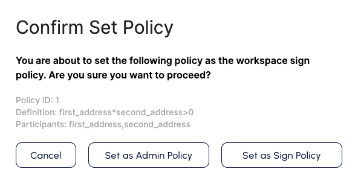

Now the workspace should show your custom policy as the sign policy. 

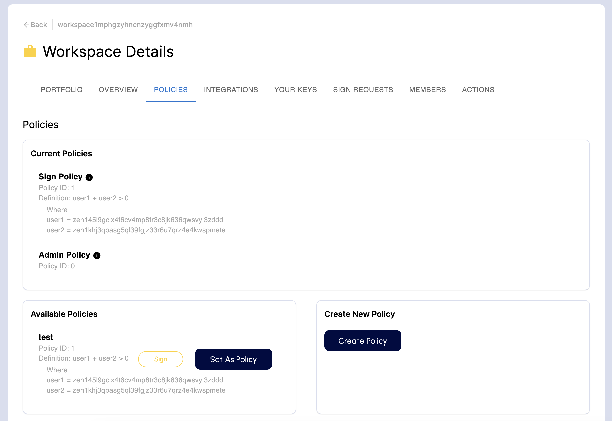

4. ***Connect with WalletConnect Test App***

Now go back to WalletConnect test app and if you haven't done already connect it with the frontend as in the [previous steps](walletConnect.md) and select the key you want to use. Approve the session in the web application.

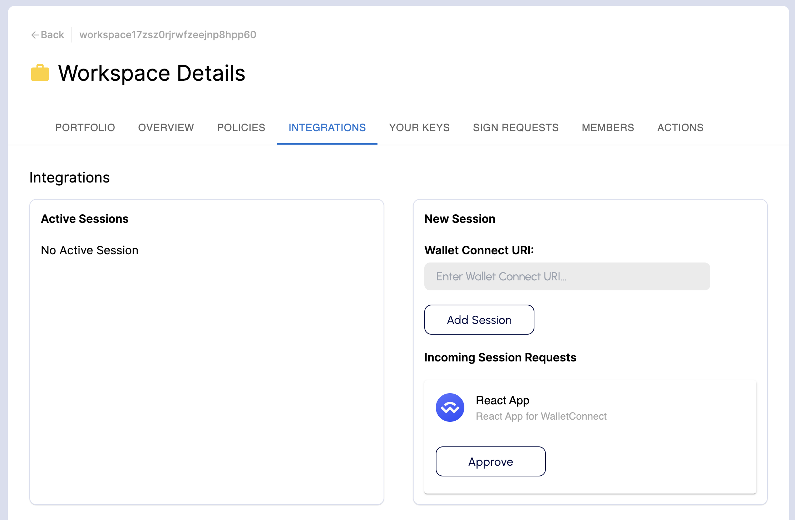

5. ***Make a Personal Sign Request***

Once the connection is established, select “Personal Sign”. This will again trigger a signature request on the zrChain web application. Approve the signature request and publish it on zrChain. 

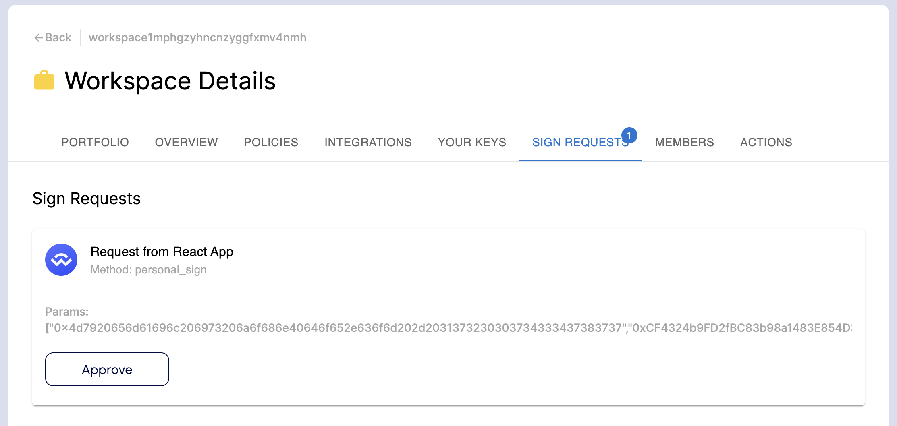

6. ***Pending Request***

As you may notice, the request is not yet executed as it waits for the other account to approve - this is the account which you made a member of the Workspace and added as a required party in the policy.

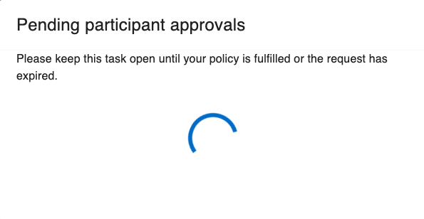

Now switch to the second account that is a member of the workspace to continue.

7. ***Prepare Second Account***

Open a new browser window and connect your second account with the zrChain frontend. Get some funds from the faucet to cover gas and transaction fees.

We are also going to support Passkeys that let you approve the action for a second device. This will add another layer of security to action approvals within a workspace.

8. ***Pending Action***

For the second account, you notice that a notification is shown over the `Actions` tab. You can see it corresponds with the signature request initiated with your first account. 

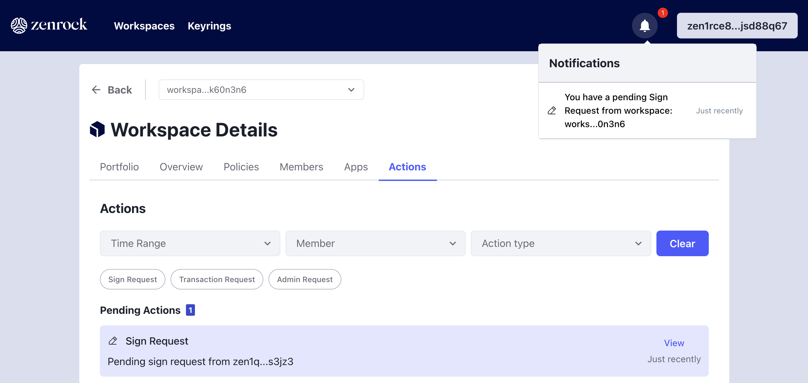

9. ***Approve Action***

Approve the action with a transaction coming from Keplr to approve the action and start the execution process of the request. 

10. ***Complete Personal Sign***

Once the MPC Network returns the signature, the WalletConnect page shows the successful execution of the personal sign process.

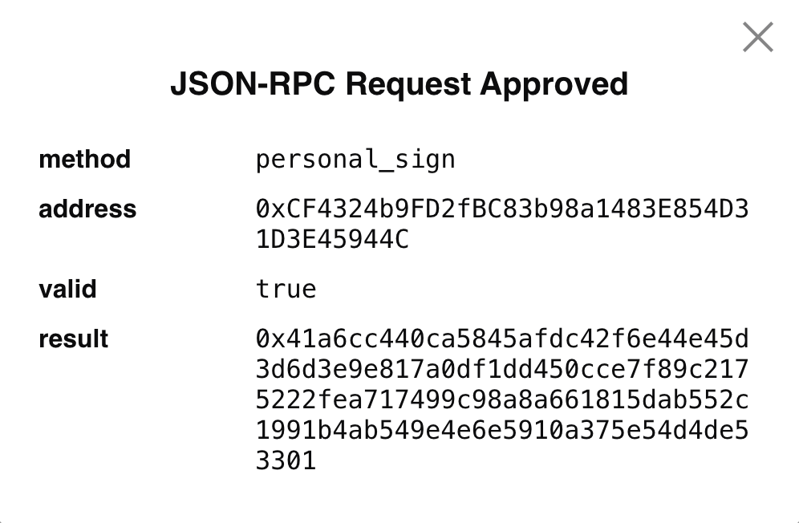
