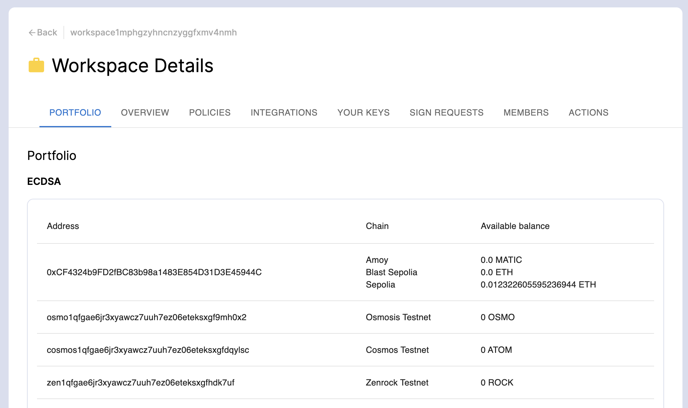
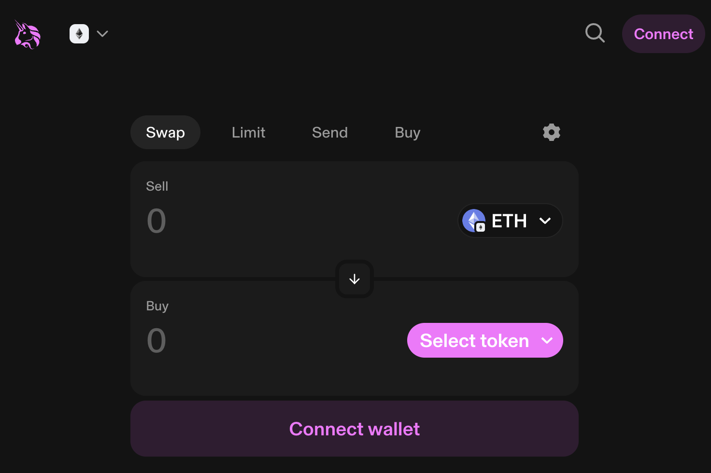
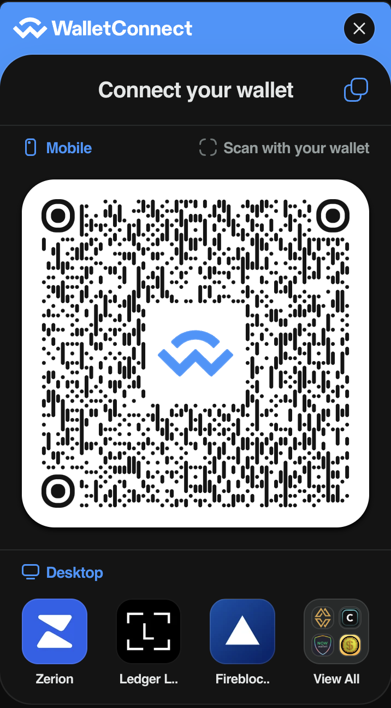
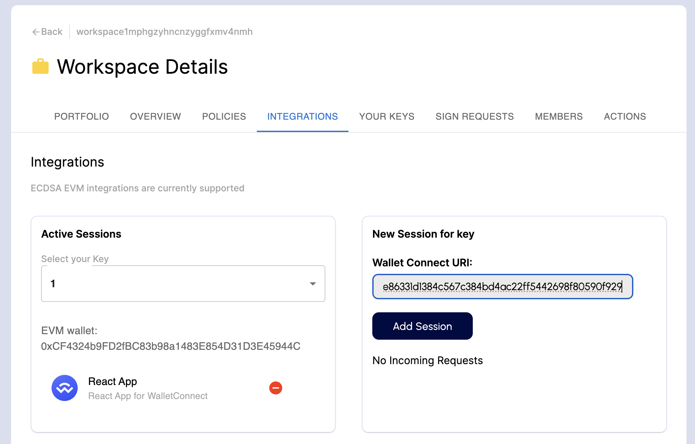
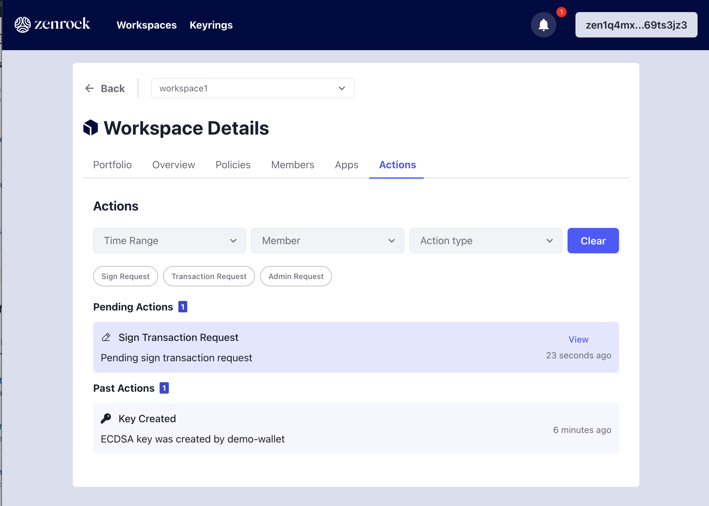

In this process, we want to swap Sepolia ETH to Wrapped ETH on Uniswap’s testnet. 

1. ***Fund your Sepolia Wallet***
Before we start, fund your MPC generated address to have funds for gas and the swap payload. A popular faucet you can use is [Alchemy](https://www.alchemy.com/faucets/ethereum-sepolia). See the ETH balance of the address in the Portfolio View of the Zenrock web application.

2. ***Uniswap Testnet***
Next, go to the TESTNET version of Uniswap by clicking on this link: [https://app.uniswap.org/swap?chain=sepolia](https://app.uniswap.org/swap?chain=sepolia)
It should look like this:

3. ***Establish Connection***
Now go to “Connect” and connect your WalletConnect session with the web application. Copy the URI from the “copy” icon on the top right corner above the QR code. Paste it in the WalletConnect URI input field on the integrations tab in the web application.
Make sure you are connected by checking the connected address on Uniswap is the same as the one selected on the Zenrock web application. 

4. ***Initiate Swap***

Now select WETH as the token to swap your Sepolia ETH. Select a tiny amount, for example 0.001 ETH to swap to 0.001 WETH. Click on `Swap`. 

5. ***Execute Request on zrChain***

After you clicked on `Swap` go back to the Zenrock chain web application. Again you can see an icon over the `Sign Request` tab on the Workspace view. Click it to send the transaction request to zrChain and the MPC Network. 

6. ***Swap is Pending***

The MPC Network returns the signature request which gets routed to the WalletConnect. The transaction is executed and you can check its status on the block explorer. 

7. ***Confirmation***

Once it is confirmed, you will see WETH in your MPC generated wallet. 