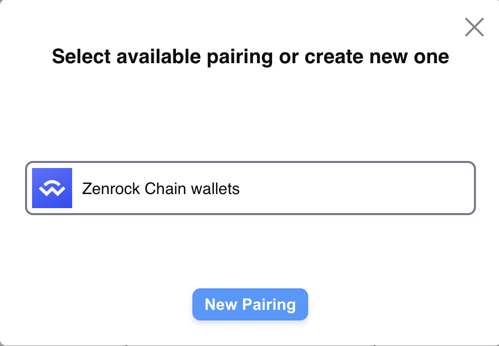
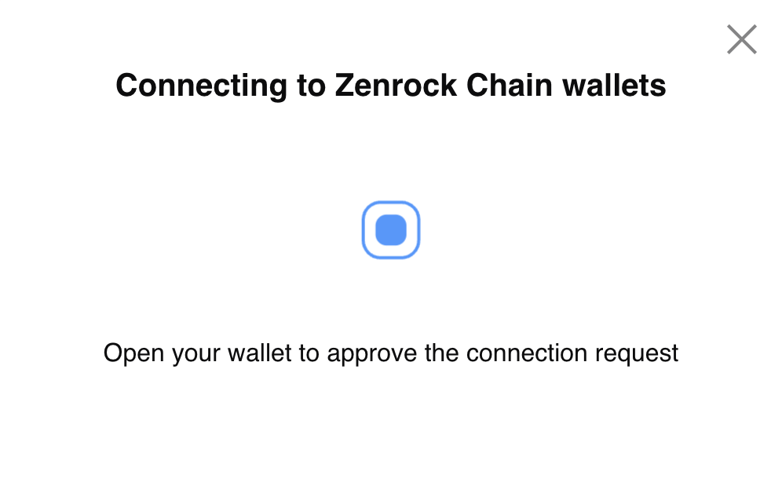

The following steps show how to connect the Zenrock web application to WalletConnect:

1. Go to the WalletConnect test environment: [https://react-app.walletconnect.com/](https://react-app.walletconnect.com/).
2. Select `Sepolia` as a network, scroll down and click on `connect`. Select `Zenrock Chain Wallets`. This will let you access your mpc MPC generated keys stored in your workspace on zrChain.

TODO - Correct screenshots

3. Go back to the Zenrock Web Application in the tab `Integrations`. Here, click on approve to finalise the connection with WalletConnect.

4. Now go back to the WalletConnect App and you see that the key from zrChain is selected in the wallet.

