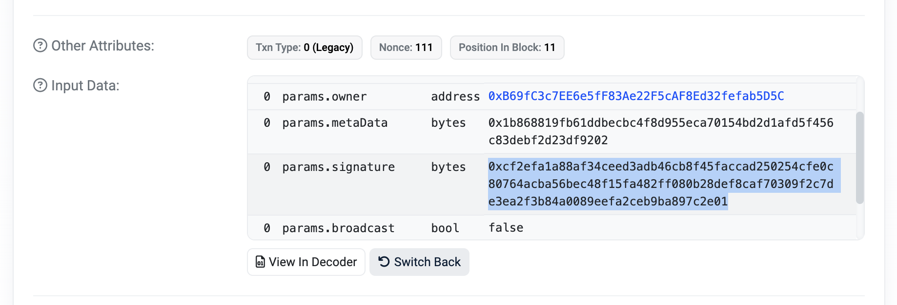

In this guide we will go over how to deploy a vanilla zrSign contract and interact with it. It should serve as a good starting point to get familiar with zrSign and let developerscustomize it to their own ideas and processes. 

To get started, head to the [zrSign Hello World repository](https://github.com/zenrocklabs/zr-sign-hello-world/) and clone it on your machine.

```bash
git clone https://github.com/zenrocklabs/zr-sign-hello-world.git
```

Once you have the repository cloned, you can follow the steps in the README to set the right environment variables and build the project. When the contract is built, head to Etherscan and create your first zrSign key. 

The deployed smart contract interfaces directly with the zrSign smart contract that Zenrock's MPCs are subscribed to. Read about its core functionality [here](../../zrSign/concepts/zrSign.md).

1. Request an EVM key

As the first step, you need to request your first EVM key. Go to your contract on Etherscan and click on the `Write Contract` tab, alternatively you can craft a transaction directly via your own wallet. Connect with your wallet. 
Click on `requestNewEvmKey()` and set the right parameters. Attribute `requestNewEVMWallet` is for funding your contract to be able to pay for the request fee for zrSign. Funding it with 0.01 ETH should be enough to begin with. Next, in `options` you should type `1` to indicate that you want an EVM key. 

<div style={{maxWidth: "600px", margin: "0 auto"}}>


</div>

When executing, Metamask might encounter difficulties with assessign the right amount of gas. If this is the case, try bumping up the gas limit by adding a 0 and clicking on `Write` again. 

2. Verify you Wallet Address

Once your transaction was successful, retrieve your wallet address from the contract. Go to the `Read Contract` tab and click on `getEVMWallets` which should list the list of your requested EVM wallets. The wallets are being specified by their wallet index.

3. Request a signature

Lastly, request a signature for a message of your choice. Go to the `Write Contract` tab and click on `signMessage`. You need to set the right parameters. 
`signMessage` can be left with 0 if the contract has enough funds in it. `message` contains the message that you want to have signed. This can be any arbitrary string like `helloworld` or an unsigned transaction hash. `walletIndex` is the index of the wallet you want to sign with and `dstChainId` is the chain you want to sign the message for. For Base Sepolia the chain id is: 

```bash
0x8a9a9c58b754a98f1ff302a7ead652cfd23eb36a5791767b5d185067dd9481c2
```

<div style={{maxWidth: "600px", margin: "0 auto"}}>


</div>

Once the transaction succeeded, the MPCs have published their responses for your signature request. You can find it on your transaction details page at `Input Data` and then look for the `params.signature` field.

<div style={{maxWidth: "600px", margin: "0 auto"}}>



</div>

***Congratulations! You have successfully deployed your zrSign smart contract, requested an EVM key, and requested a signature for your your MPC key.***