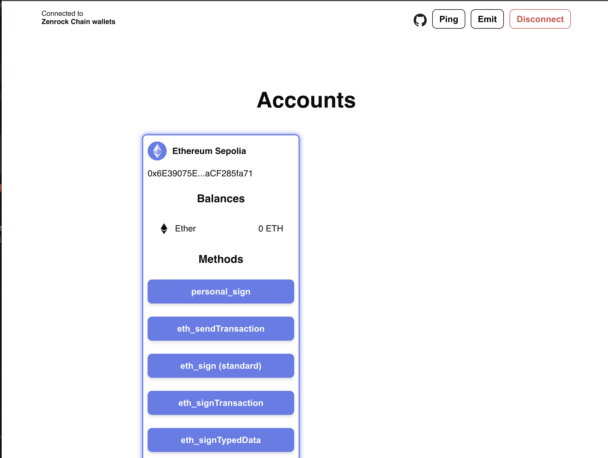
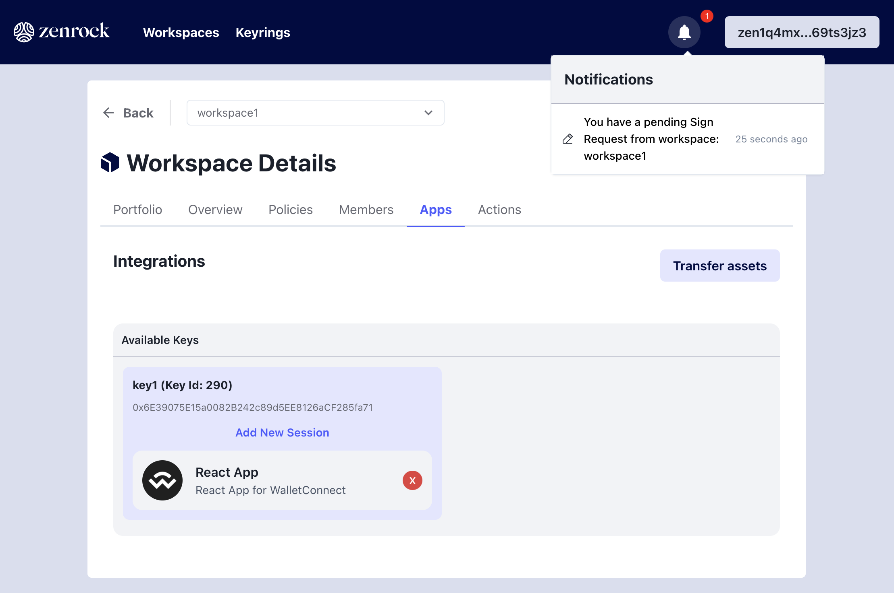
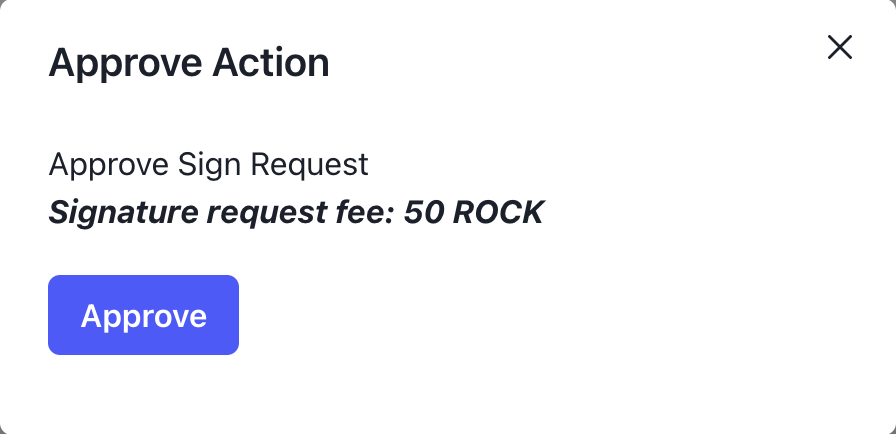
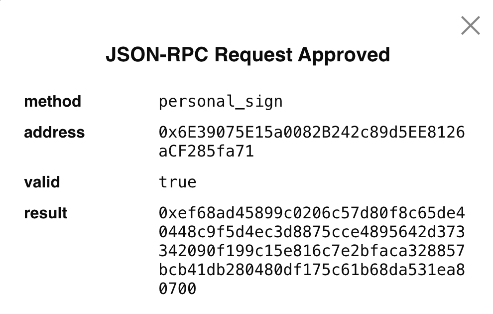

### Key Connection Established

After establishing a connection with a zrChain key within WalletConnect, you should see a list of methods that WalletConnect provides. We are interested in the first one - "Personal Sign". 
Personal sign is a simple signature request that is not used to sign a transaction. It can be used for authentication purposes to prove ownership of this address.
The other methods exposed on this frontend are not relevant for this guide, but are important for developers who want to use them. zrChain supports these types of WalletConnect methods and can be invoked through a dApp.

 

### Request Personal Sign 

In the WalletConnect App, click on `personal_sign` and you will see it prompts a sign request for the connected wallet. Back on the web application, you should see a pending action indicated by a notification on the bell icon on the top right.

### Approve Sign Request

Click on the bell icon to get forwarded to your actions tab. As you can see, there is one pending action to approve a signature request. This request is the one coming from WalletConnect. 

Click on `View` for more details and and click on `Approve` to approve the request. 

Approving it creates a signature request transaction on zrChain with the payload provided by the request from WalletConnect. Approve the request. 

### Personal Sign Result 

The MPC Network processes the request and returns a signature. This signature gets returned to the WalletConnect app where it gets verified. After successful verification, WalletConnect gives an approved notification with the details. The result is the signature returned by the MPC Network which is successfully verified.

Personal Sign is now completed.