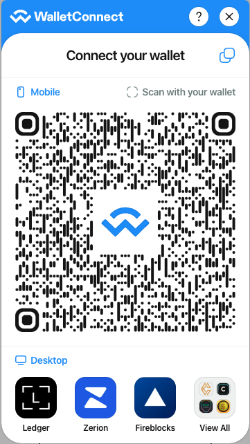
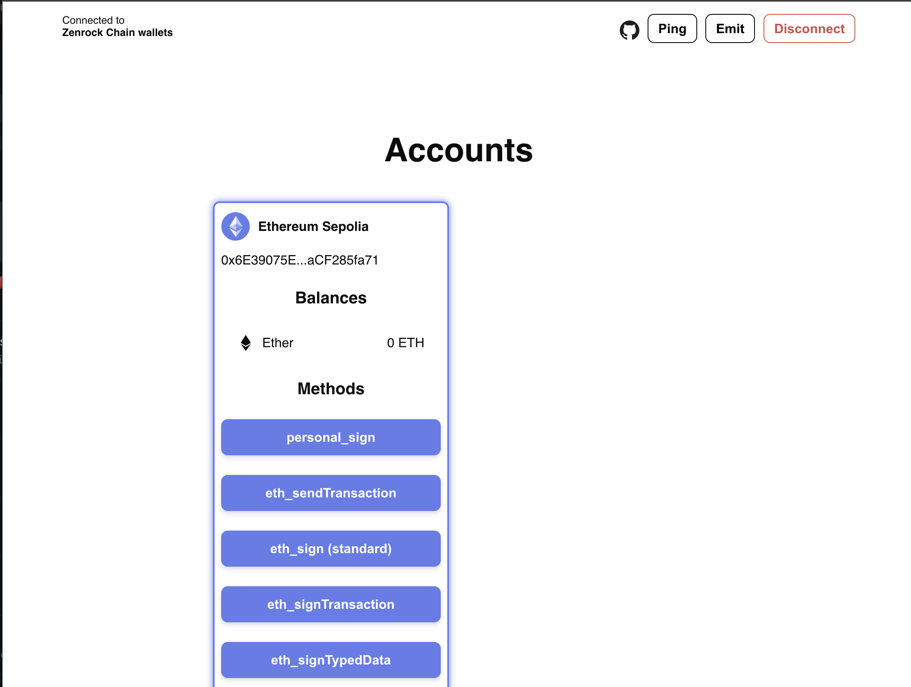

The following steps show how to connect the Zenrock web application to WalletConnect:

### Open WalletConnect

Go to the WalletConnect test environment: [https://react-app.walletconnect.com/](https://react-app.walletconnect.com/).

### Initiate Session

Select `Sepolia` as a network, scroll down and click on `connect`. This will prompt a QR code. On the top right, copy the payload (a WalletConnect URI) and go back to the integrations tab in the web application. Chose the key you want to connect with and enter the URI and approve the session.

If you have done the previous step already, you will directly get prompted to select `Zenrock Chain Wallets`. This will let you access your mpc MPC generated keys stored in your workspace on zrChain. Alternatively, click on "New Pairing" to start a new session. In this case, we recommend to reload the page of the web application, too.

  
  

### Approve Connection on Zenrock

Go back to the Zenrock Web Application in the tab `Integrations`. Here, click on approve to finalise the connection with WalletConnect.

### Verify Connection is Established

Now go back to the WalletConnect App and you see that the key from zrChain is selected in the wallet.

