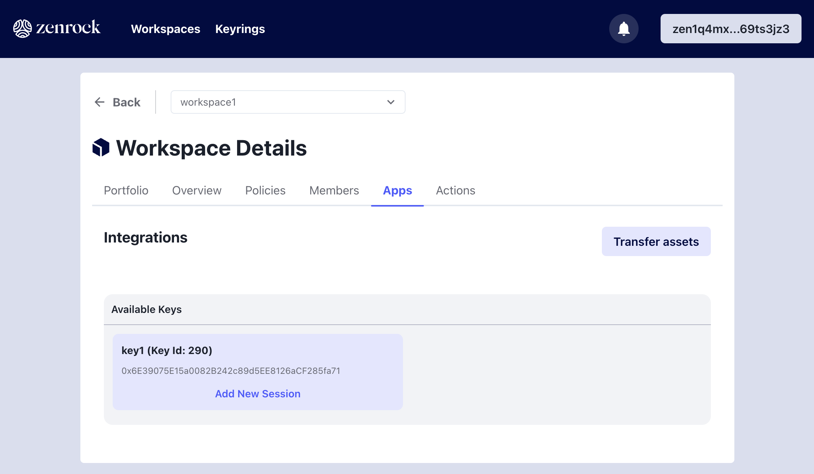
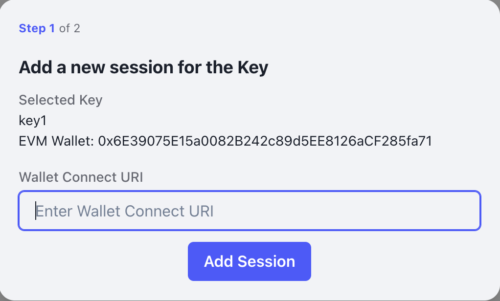
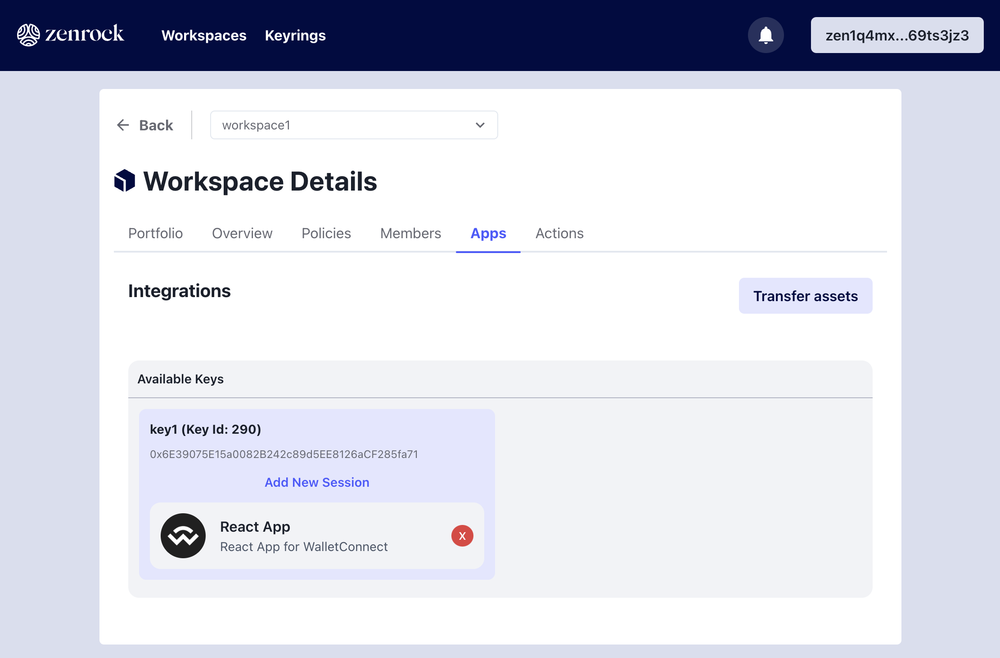

The following steps show how to connect the Zenrock web application to WalletConnect:

### Open WalletConnect

Go to the WalletConnect test environment: [https://react-app.walletconnect.com/](https://react-app.walletconnect.com/).

### Initiate Session

Select `Sepolia` as a network, scroll down and click on `connect`. This will prompt a QR code. On the top right, copy the payload (a WalletConnect URI) and go back to the `Apps` tab in the web application for your workspace. Chose the key you want to connect with and click on `Add New Session` enter the URI and approve the session.

Afterwards, you can enter the URI that you copied from WalletConnect in the field `Enter WalletConnect URI` and click on `Add Session`. Next you need to approve it to tie it to the MPC key in your workspace.

If you have done the previous step already, you will directly get prompted to select `Zenrock Chain Wallets`. This will let you access your MPC generated keys stored in your workspace on zrChain. Alternatively, click on "New Pairing" to start a new session. In this case, we recommend to reload the page of the web application, too.

  
  

### Verify Connection is Established

On the Apps tab in the web application you can see that the Session for WalletConnect is added. You can also see it on the WalletConnect App directly.

Now go back to the WalletConnect App and you see that the key from zrChain is selected in the wallet.

