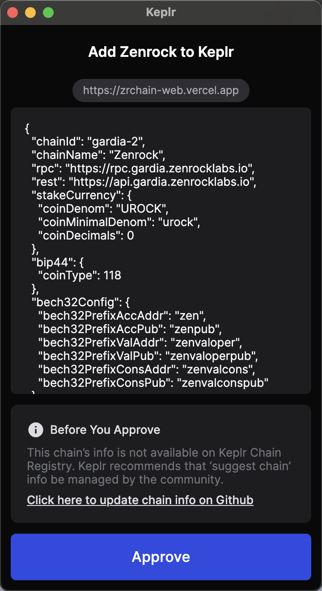
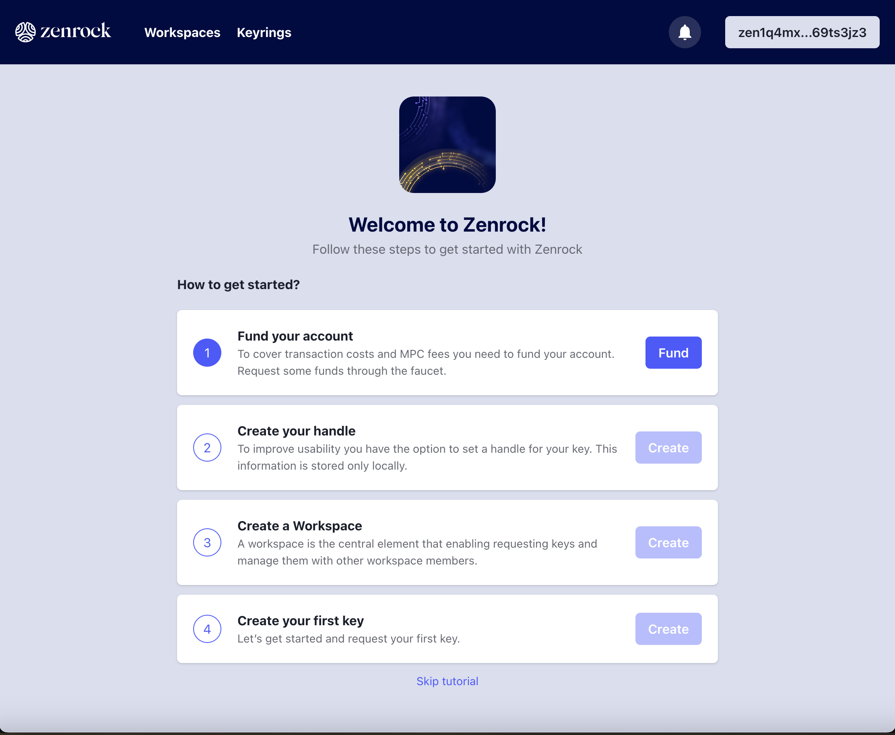

Here you can find the necessary steps to set up your wallets and fund your account.

### Install Wallet

First, you need to install the correct wallet to interact with zrChain.

At the time of writing, we support the [Keplr wallet](https://www.keplr.app/) and [Leap Wallet](https://www.leapwallet.io/) - support for other wallets will be added in the near future. This guide will use the Keplr wallet but the steps for Leap Wallet are very similar. Once you have fully installed Keplr (including making a backup of the wallet seed phrase), go to the [web application](https://gardia.zenrocklabs.io/) to connect your wallet with the testnet. On the top right corner, click "Connect Wallet" and select "Keplr" to connect your wallet. You may get a prompt asking you to add zrchain to Keplr. Please click on "Approve" to add the network.

To manage your Zenrock account in Keplr, add the Zenrock network to the list of visible chains:
`Open Keplr` —> `Settings` —> `Manage Chain Visibility` —> `Search for “Zenrock”` —> `set checkbox`.

### Fund your Wallet with ROCK

When first accessing the frontend with an empty wallet, you will immediately be prompted to request some ROCK tokens from the faucet. Check out our [Discord Server](https://discord.gg/zenrock) to access the faucet (channel [zenFaucet-Gardia](https://discord.com/channels/1226844560181952594/1280605155376763051)) to request testnet tokens. After successfully passing the verification, go to the faucet channel and follow the pinned instructions to request your ROCK.

ROCK is the native token of zrChain and is required for gas fees, governance and keyring fees.

### Zenrock Chain Explorer

zrChain testnet comes with its own block explorer where you can see your transactions on zrChain. The block explorer is accessible [here](https://explorer.gardia.zenrocklabs.io).

### You are all set up!

You can now proceed to the [Zenrock Tutorial](./zenrock-guide.md) to start interacting with the zrChain.