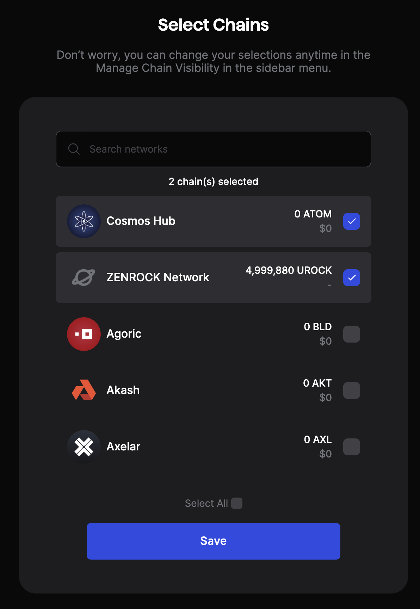
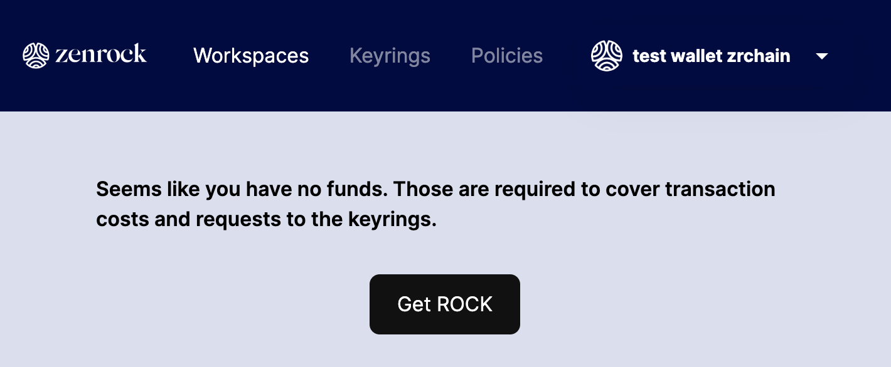

Here you can find the necessary steps to set up your wallets and fund your account.

### Install Wallet

First, you need to install the correct wallet to interact with zrChain.

At the time of writing, we support the [Keplr wallet](https://www.keplr.app/) - support for other wallets will be added in the near future. Once you have fully installed Keplr (including making a backup of the wallet seedphrase), go to the [web application](https://gardia.zenrocklabs.io/) to connect your wallet with the testnet.

To manage your Zenrock account in Keplr, add the Zenrock network to the list of visible chains:
`Open Keplr` —> `Settings` —> `Manage Chain Visibility` —> `Search for “Zenrock”` —> `set checkbox`.

<div style={{maxWidth: "400px", margin: "0 auto"}}>



</div>

### Fund your Wallet with ROCK

When first accessing the frontend with an empty wallet, you will immediately be prompted to request some ROCK tokens from the faucet.

$ROCK is the native token of zrChain and is required for gas fees, governance and keyring fees.

Alternatively, you can request ROCK via the wallet menu on the top right or make a direct http request to the faucet: 

```bash
curl <https://faucet.gardia.zenrocklabs.io> -XPOST -d'{"address":"<YOUR ZENROCK ADDRESS>"}'
```

<div style={{maxWidth: "600px", margin: "0 auto"}}>



</div>

### Zenrock Chain Explorer

zrChain testnet comes with its own block explorer where you can see your transactions on zrChain. The block explorer is accessible [here](https://explorer.gardia.zenrocklabs.io).