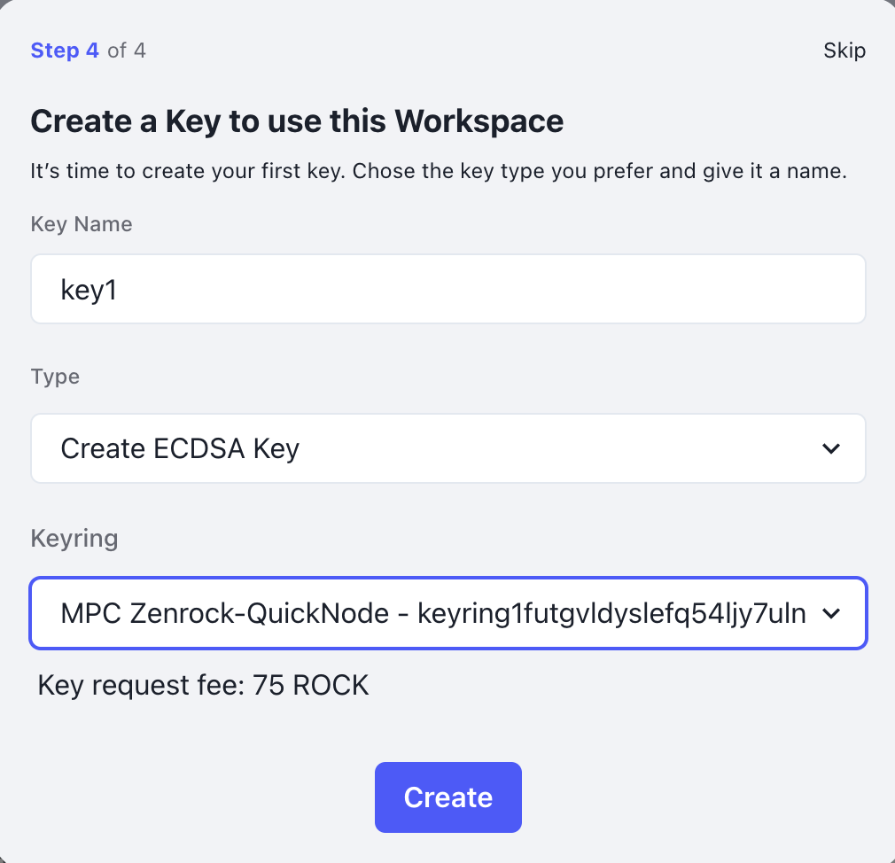

This page will guide you through zenrock chain from creating a workspace to creating a key from the keyrings. 

### 1. Create a Workspace

After funding your account from the faucet, it’s time to interact with zrChain. First, go to your [workspaces](https://gardia.zenrocklabs.io/workspaces) and click on the button to create your first workspace if you don’t already have one. Sign the transaction request prompted by Keplr.

This workspace will allow you to request keys from the keyrings. 

### 2. Review the Workspace

1. ***Portfolio***: Here you will later see the addresses derived for certain networks from respective key types. These addresses are yours that the workspace controls. 

 

2. ***Overview***: Here you have general overview of your workspace. Who the owners are, who created the workspace, which policies are in place. It also provides functions to change attributes.

3. ***Policies***: Here you can manage the policies for your workspace. You can see which policies are available for you or you can create new ones. 
Policies are applied to the workspace. After workspace creation, default policies are in place which require one member to initiate a key or signature request. In a later step, we will add custom policies with individual logic to your workspace. 

4. ***Web3 Integrations***: Here you can connect your keys with other dApps for example via WalletConnect. This is important as this allows you to access the broad functions of the web3 ecosystem. Initial integration is focused on EVM and WalletConnect and we will add more features here soon.

5. ***Your Keys***: On this page you get an overview of keys you have created and the ability to create new ones.

6. ***Signature Requests***: When a new signature request is about to be published, you need to approve it on this screen in order for it to be broadcasted to zrChain and start the signing process.

7. ***Members***: Manage who is a member of your workspace.

8. ***Actions***: If a different member of the workspace makes a request and the workspace has a policy that requires the connected account’s approval, an action is displayed. You can either reject or approve it to start the intended process. 

### 3. Key Request

Now it’s time to create your first key. To do so, navigate to the “Your Keys” tab in the workspace menu. Select your key type. Once you approve the transaction in Keplr, a key request is emitted. The MPC Network polls the chain for such requests and processes the request when it appears. Once the key from the MPC is returned, you can see that a new key has been added to the list. 

### 4. Check your accounts

Go to your Portfolio to see the addresses that can be derived from your key. You are in control of those keys and can request signatures for those keys.

