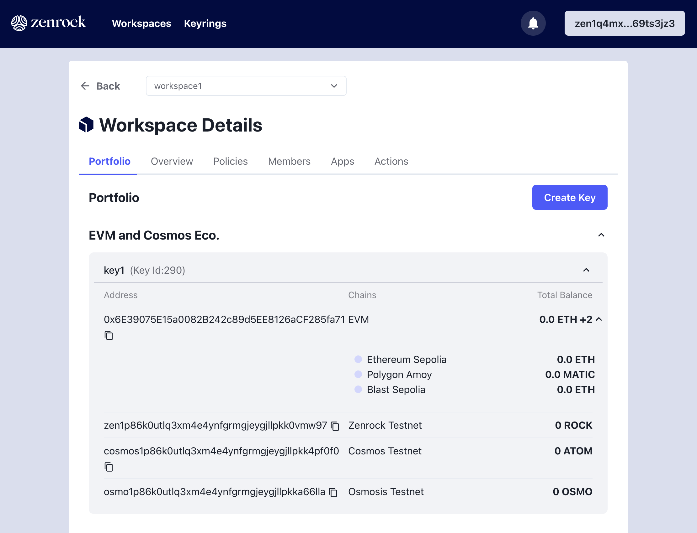

This page will guide you through zenrock chain from creating a workspace to creating a key from the keyrings. 
Make sure you have completed the [setup steps](./setup.md) before proceeding and that you are on this URL: [https://gardia.zenrocklabs.io/onboard/get-started](https://gardia.zenrocklabs.io/onboard/get-started).

### 1. Fund your Wallet with ROCK

Once your wallet is successfully connected, you will be redirected to a welcome page that contain some tasks for you to make sure you are setup correctly. The first step is to receive some testnet ROCK that allows you to pay for transaction fees on zrChain and to request keys and signatures later in the tutorial. Click on `Fund` to receive your first ROCK or on `Skip Tutorial` if you want to go directly to the next step.

<div style={{maxWidth: "600px", margin: "0 auto"}}>


</div>

Once completed, you will receive a notification that you have successfully funded your wallet.

Alternatively, you can request ROCK via the wallet menu on the top right or make a direct http request to the faucet: 

```bash
curl <https://faucet.gardia.zenrocklabs.io> -XPOST -d'{"address":"<YOUR ZENROCK ADDRESS>"}'
```

### 2. Create a Username

To make the user experience more intuitive and personalized, we have implemented a username system which is tied to your key from your wallet. You can set your username on the next prompt. The username will not be stored on-chain won't be exposed to anyone but you on the web application.

<div style={{maxWidth: "400px", margin: "0 auto"}}>


</div>


### 3. Create a Workspace

After funding your account from the faucet, it’s time to interact with zrChain. The guide will prompt a create workspace prompt right after you created a username. Click on the button to create your first workspace if you don’t already have one. Sign the transaction request prompted by Keplr.

This workspace will allow you to request keys from the keyrings. 

<div style={{maxWidth: "400px", margin: "0 auto"}}>


</div>

### 4. Your First Key Request

Now it’s time to create your first key. After creating a workspace, a prompt appears that lets you create your first key. You are able to give it a name that helps you identify it later. You can choose between different key types, in this case we are using an ECDSA key, which is the standard key type for EVM and Cosmos chains. Select a keyring from the dropdown menu and click on `Create` to submit the key request. Approve the transaction and wait for a moment for the MPC to create the key and publish the public key on-chain.

<div style={{maxWidth: "400px", margin: "0 auto"}}>


</div>

### 4. Check your workspaces

If not redirected after clicking on `finish` go to your [workspace overview](https://gardia.zenrocklabs.io/workspaces) to see the workspace that you just created and see it also has a key listed in it. 

<div style={{maxWidth: "400px", margin: "0 auto"}}>


</div>

Click on the workspace to open it and see the key that you just created. You can also the the derived addresses for the key and their balance.

<div style={{maxWidth: "800px", margin: "0 auto"}}>



</div>