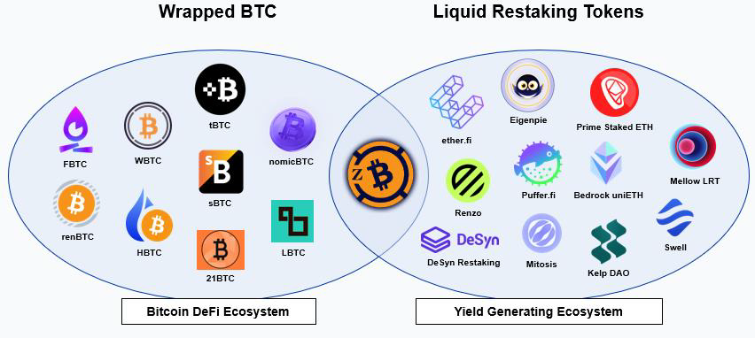
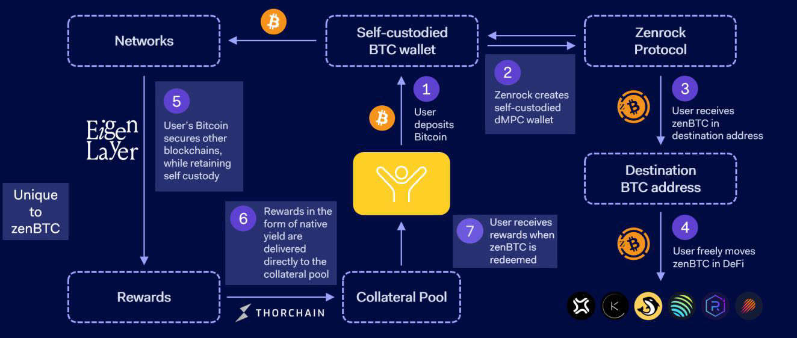
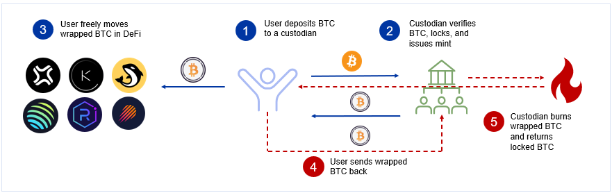

## zenBTC: The First Native-Yield Bearing Wrapped Bitcoin

zenBTC is a fully decentralized wrapped Bitcoin product with built-in native yield, that launched in Q1 2025. Positioned as the first decentralized custody token (DCT) combining institutional-grade security with native yield, zenBTC redefines Bitcoin interoperability and utility in DeFi.

### Decentralized by Design

zenBTC leverages Zenrock’s proprietary distributed MPC (dMPC) technology to eliminate centralized control over locked Bitcoin. dMPC is an advanced security layer that gives users direct, permissionless control over their digital assets. While traditional MPC is a proven, institutional-grade cryptographic standard, dMPC represents the next evolution of this technology. It is fully decentralized and operates on-chain. With dMPC, key shards are distributed across a network of independent third-party node operators, ensuring that no single entity ever holds the complete private key. Only the initial user can make a key request and complete transaction signings. This eliminates risks associated with centralized custody and the need for institutional trust. When minting zenBTC tokens, deposited Bitcoin remains locked on the Bitcoin blockchain, untouched until zenBTC is redeemed.

zenBTC’s dMPC security is underpinned by Zenrock’s native utility and governance token, $ROCK, which serves as the foundation of the entire Zenrock ecosystem. $ROCK drives network participation through carefully designed incentives. Key and signature request fees for zenBTC—triggered during minting and burning—are received in or converted to $ROCK. Additionally, $ROCK functions as a reward mechanism for validators who maintain the dMPC network. These validators play a critical role in key assembly, with network security strengthening as more validators join.

### Finally, Native Yield-Bearing Bitcoin

zenBTC uniquely allows users to accrue yield directly in Bitcoin (sats), growing their Bitcoin balance rather than awarding points or credits. No other wrapped Bitcoin product combines fully decentralized custody with native yield. Yield is generated from protocol fees: 35% of zenBTC custody fees and 5% of all zrChain fees are distributed to zenBTC holders. The underlying BTC is never lent out or used as risk capital, ensuring the safest form of Bitcoin yield in crypto. While users' Bitcoin remains securely locked on the Bitcoin blockchain via dMPC, yield accumulates through organic protocol activity rather than external DeFi strategies.

Protocol fees are automatically converted to BTC and reflected in the zenBTC exchange rate, meaning users' zenBTC balance grows in purchasing power over time. Today's processes for earning Bitcoin yield are complex, requiring significant time, education, and analysis—barriers that discourage adoption. By simplifying this process, zenBTC unlocks a new market segment: long-term Bitcoin holders and perp/margin traders seeking to use zenBTC as collateral.

As the Zenrock ecosystem grows, protocol fee revenue is expected to increase proportionally, providing zenBTC holders with sustainable and growing yield over time.

Yield breakdown: [https://app.zenrocklabs.io/zenbtc/yield](https://app.zenrocklabs.io/zenbtc/yield)

### Solana-First and Multichain Ready

zenBTC is built for multichain flexibility, offering seamless integration across a range of DeFi ecosystems. At launch, the focus will center on Solana, a blockchain known for its high-speed performance and low transaction costs. The Solana rollout is bolstered by partnerships with key protocols such as Kamino, Orca, Jito, and Jupiter. These partnerships are designed to enhance zenBTC’s adoption through simple integrations, co-incentive mechanisms, and coordinated marketing campaigns.

Given the current shortage of wrapped Bitcoin products available on Solana, zenBTC taps into a significant market opportunity, providing Bitcoin liquidity in a blockchain ecosystem that has experienced immense DeFi demand. Beyond liquidity, the partnerships are aimed at driving Bitcoin innovation—enabling users to seamlessly utilize zenBTC for yield generation, trading, and collateral within the Solana DeFi ecosystem.

### Empowering Users Across Several Verticals

The initial total value locked (TVL) for zenBTC will be driven by LOIs secured from large Bitcoin holders, ensuring a strong foundation for adoption. Zenrock is further incentivizing early deposits through its Alpha Vault program, as well as partnerships with selected decentralized exchanges (DEXs) and borrow/lend protocols.

The demand for zenBTC is expected to be broad and diverse, appealing to several key market segments. In the near term, the primary addressable market is Solana DeFi, where traders can utilize zenBTC as highly efficient on-chain collateral. For institutional investors and long-term Bitcoin holders, zenBTC offers the unique advantage of earning passive income on BTC with fully decentralized security—addressing a critical need in today’s market. Further, crypto exchanges may fuel additional demand as they look to offer more diverse trading pairs and innovative financial products with zenBTC.

### Competitive Positioning

zenBTC enters a competitive market where existing players are increasingly scrutinized for their centralization risks. The leading product, wBTC, has come under fire following BitGo’s joint venture with BiT Global in August 2024 that established multi-jurisdictional custody. This move introduced Justin Sun, a strategic partner and owner of Poloniex, into the equation—raising serious concerns about transparency and the risks of centralized control. Notably, Poloniex does not disclose the location of its Bitcoin reserves or the security systems safeguarding them, leaving users uneasy about the safety of their holdings.

This controversy created a massive gap in the market, sparking demand for decentralized alternatives. As a result, new wrapped Bitcoin products grew AUM by $2.3 billion in this year alone. However, none of these products pair fully decentralized security with native yield, leaving zenBTC uniquely positioned to address this unmet need. On Solana specifically, zenBTC faces limited competition, with cbBTC being the only other product operating at scale. Yet, cbBTC faces the same centralization concerns as wBTC due to its affiliation with Coinbase. By contrast, zenBTC offers fully decentralized custody through Zenrock’s dMPC technology, combined with native yield—a first-of-its-kind value proposition.

Most wrapped Bitcoin products were developed before decentralized security technologies like distributed MPC (dMPC) existed, relying instead on multi-sig wallets. Transitioning to decentralized custody now poses a significant challenge for these competitors. Achieving true decentralization would require a complete overhaul of technology stacks, including rewriting smart contracts for existing assets—a costly and time-intensive process. Further, most competing products have incredibly difficult user experiences. For example, tBTC is minted on ETH and then bridged. Achieving yield on BTC is never easy in DeFi. Most wrapped Bitcoin products either offer no yield or require users to manually deploy assets into risky DeFi protocols. zenBTC's protocol fee-based yield is automatic and requires no additional action from users—the underlying BTC is never exposed to external protocol risk.

### Wrapped Bitcoin Explained

Wrapped Bitcoin products allow Bitcoin holders to unlock new opportunities in the world of DeFi. The process begins when Bitcoin is deposited into a custodian, typically secured with multisig. Once the deposit is verified, the custodian mints an equivalent amount of wrapped Bitcoin, which can then be used across various decentralized applications.

When users want to redeem their Bitcoin, they simply send their wrapped Bitcoin back to the custodian. The custodian or associated smart contract burns the wrapped Bitcoin and releases the original Bitcoin back to the user. This process bridges Bitcoin’s robust store-of-value properties with the flexibility and innovation of decentralized finance.

