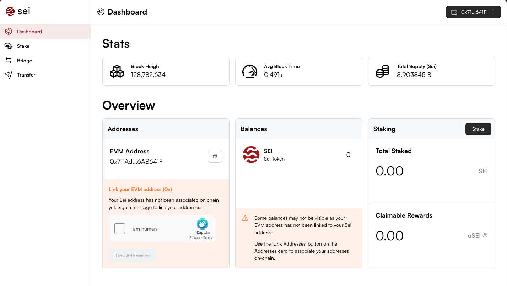
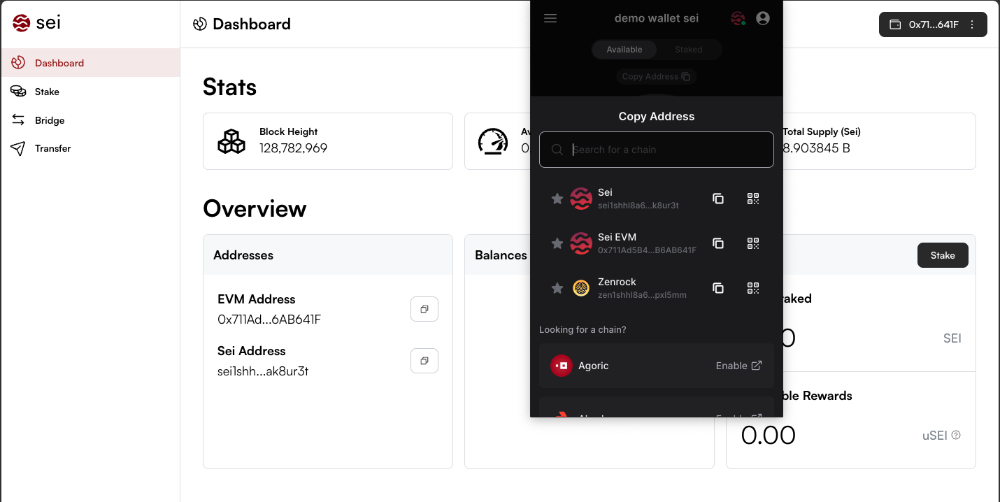
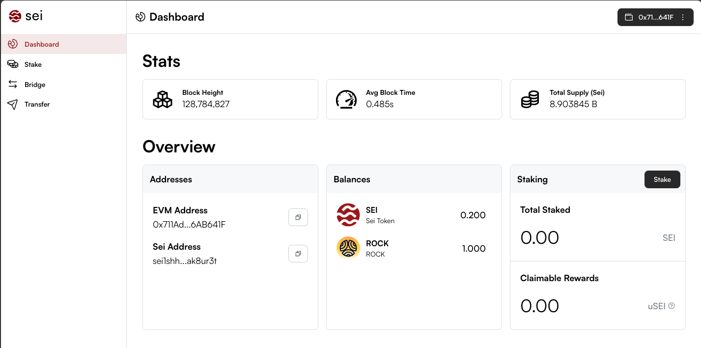
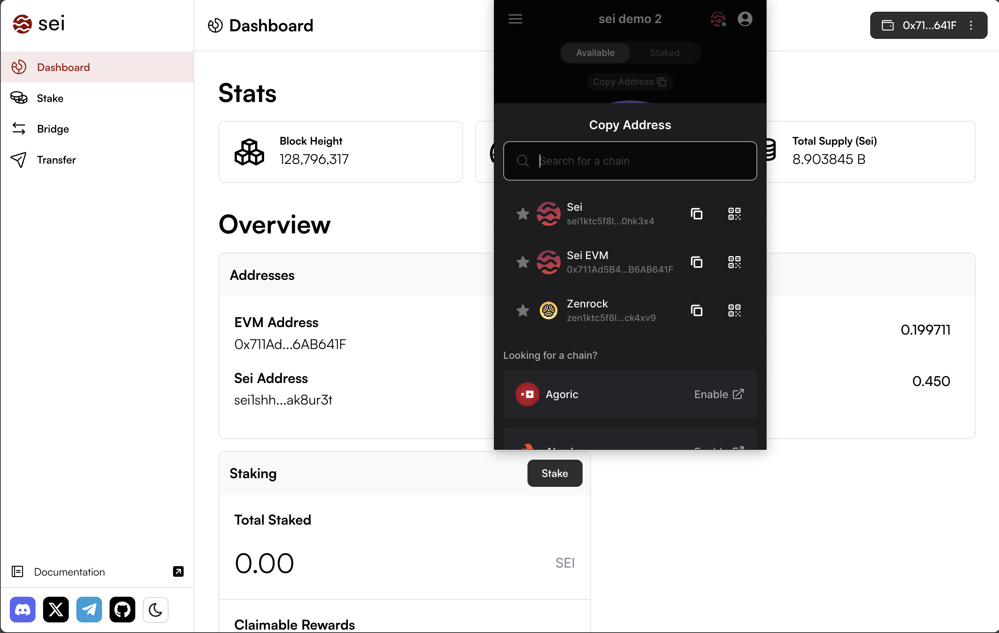

Welcome to the documentation for transferring ROCK between Sei and zrChain. This page shows the process of using MetaMask as well as Keplr through the [app.sei.io](http://app.sei.io) webpage and further highlights common errors.

To follow this guide, you need to have some SEI to cover transaction fees as well as ROCK (either Sei EVM or on Sei).

> **Warning:** For simplicity, we recommend using MetaMask to set up your Sei account, as this will always derive the correct Sei and Zenrock addresses. If you have a Keplr wallet, please follow the Keplr setup instructions below.

## Setup from MetaMask

1. **Import your MetaMask private key into Keplr:** The MetaMask account that holds some ROCK EVM should be added to the Keplr wallet that you need to interact with zrChain. You can do this by following these steps:

   - `MetaMask: Account Details -> Show private key -> COPY`
   - `Keplr: Import an existing wallet -> Use recovery phrase or private key -> Select private key -> Paste private key -> Name it and select a password -> Select ROCK Mainnet, Sei, Sei EVM in Keplr.`

2. Go to [app.sei.io](http://app.sei.io) and click on "Connect Wallet".

3. Choose MetaMask and confirm in the MetaMask popup. Switch to "Sei Network" and add the chain to your MetaMask if not already set. Confirm the switch.

4. Complete the sign-in request. This is not a transaction but just proves that you control the address you connect to the page with.

5. **Link addresses:** You need to associate a native Sei address with your 0x address. Verify the captcha and click on "link addresses." If you get an error, then reload the page. Your Sei address should match the Sei address in Keplr.

6. Ensure the accounts are funded with ROCK EVM and Sei EVM. The funds will appear as SEI and ROCK, respectively.

## Setup from Keplr

Setting up your Sei wallet with Keplr is NOT the recommended way to send ROCK to zrChain. The problem is that it derives a different Sei address than MetaMask, which can cause problems when trying to move ROCK on Sei EVM. You can see the mismatch of the Sei address in Keplr (`sei1ktc5f8l0449ntp8dll0x6enhw9kc36td0hk3x4`) with the one on [app.sei.io](https://app.sei.io) (`sei1shhl8a6388p7yyyf9x2kvm7qakx7hdeak8ur3t`).

### Workaround

As a workaround, we recommend having both Sei accounts funded that you find in your Keplr Wallet and in the Sei address under [app.sei.io](https://app.sei.io). Don't worry, both Sei accounts belong to you, and nobody else has access to them. When moving around funds on Sei, make sure the balance is high enough to cover transaction fees. For a smoother experience, we recommend importing the private key of your MetaMask account into Keplr to get the correct addresses derived.

Sending ROCK from Sei EVM to Zenrock Mainnet works as described in the [Sei EVM to Zenrock Mainnet guide](sei-to-zenrock.md). The only difference is that signing is performed with the Keplr wallet, and thus fees are deducted from the Keplr Wallet account.
