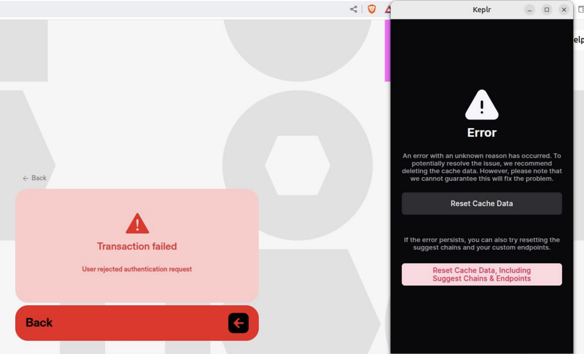

Transferring ROCK between Sei and zrChain can sometimes be tricky. Here are some common issues and how to fix them.

## I can't see my ROCK EVM in the Sei App

If you can't see your ROCK EVM in the Sei App, it's likely because there is a mismatch between the addresses in your Keplr wallet and the addresses in the Sei app. MetaMask is the recommended way to set up your Sei account, as this will always derive the correct Sei and Zenrock addresses. If you have a Keplr wallet, please follow the [Keplr setup](./sei-setup.md#setup-from-keplr) instructions below.

## I can't see my ROCK on Zenrock Mainnet

There can be a few reasons why you can't see your ROCK on Zenrock Mainnet (yet). It's recommended to wait a few minutes after the transfer has been initiated before checking your balance. If you've waited a few minutes and still can't see your ROCK, your transfer may have timed out, and you'll need to initiate a new transfer. Don't worry, your ROCK has been returned to your wallet on Sei.

## I get an error during signing on Skip

If you get an error during signing on Skip, it may be because Skip cannot fetch the correct chain information at this time. In this case, please refresh the page and try again until it works.

## Transaction failed on Skip.go

If you get an error on Skip.go one reason could be that you need to update the chain information in Keplr. To solve this, we suggest to delete cache data from Keplr and refresh the page.

