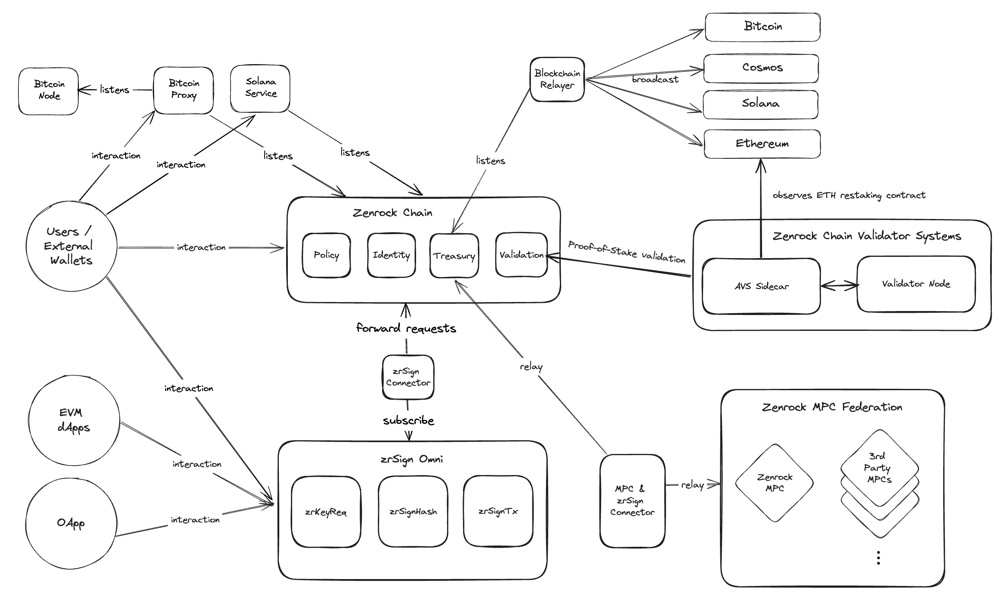

The Zenrock System Architecture defines the components involved in the blockchain-based multi-party-computation system that provides access to a broad spectrum of use cases in a secure and trustful manner.

## Zenrock Blockchain

The central component is the **_Zenrock Blockchain_**. This provides a source-of-truth that coordinates:

- New key requests e.g. using the MPC system
- Keyring registration & management
- Signature generation & management
- Policy control - enabling multi-party control of signatures

As well as the standard Cosmos modules, the Zenrock blockchain incorporates three additional modules that:

- Create and manage workspaces and keyrings in the [**_Identity Module_**](identity.md)
- Request and manage keys as well as request signatures in the [**_Treasury Module_**](treasury.md)
- Create and define policies in the [**_Policy Module_**](policy.md)

Users can interact with the Zenrock Blockchain using a self-hosted wallet or any registered keyring - such as the Zenrock MPC system.

The Zenrock blockchain gives users the ability to interact with custom modules, stake tokens and take part in governance.

As a platform agnostic signature generation & key management service, it provides unified access to some of the largest blockchain ecosystems.

## Keyrings

**_Keyrings_** define off-chain systems that manage the creation of keys and signatures. Developers are able to develop, register and use custom keyrings as required.

Keyrings are registered on the Zenrock Blockchain and thereafter receive key and signature requests that are processed off-chain.

Keyring responses are published on the Zenrock Blockchain via party-specific controllers.

The first enterprise-grade keyring is the Zenrock Multi-Party-Computation system. This provides MPC services as a keyring thereby allowing participants to diversify control and manage risk.

## Relayers

**_Relayers_** assemble unsigned transactions and the returned signatures and broadcast these to the relevant network.

In case of private transactions, where no details about the payload are disclosed, the requesting party needs to run their own relayer.
