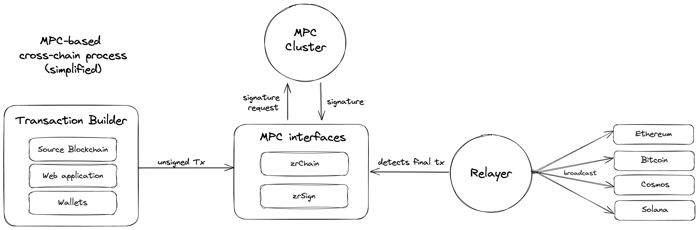

This page is dedicated to the cross-chain strategy of the Zenrock MPC nodes and to highlight the simplicity of MPC-based cross-chain messaging compared to other solutions.

### Cross-Chain Problem

The number of blockchains in the space is rapidly growing and so is the fragementation of liquidity, use cases and developer attention. This fragmentation makes it difficult for users to navigate the space and for developers to build on top of it.

Zenrock aims to solve this fragmentation by providing an MPC-based protocol that allows users to send and receive messages on and across different blockchains with the same level of security as the blockchain they originated from where the users can chose their security level based on their risk appetite.

### Cross-Chain Solutions

The most common way to communicate cross chain is with a centralized bridge. While these bridges are useful, they come with their own set of risks such as single points of failure, loss of funds due to exploits and human error, and the need for users to trust the bridge with their assets. On top of that, it often includes many and larger smart contract interactions which can take a long time to execute and therefore higher transaction fees.

Most popular protocols like LayerZero, Wormhole and Axelar often have a very strong integration with both sides of the bridge that allows them to reliably send messages across and provide additional features like synchronous communication to confirm the successful execution of the message like it is with LayerZero.

In Cosmos the [Inter-Blockchain Communication Protocol (IBC)](https://ibcprotocol.org/) is the standard way to communicate between blockchains. IBC is a protocol that allows for secure and reliable communication between different blockchains. It is supported by most of the major blockchain projects in Cosmos and is the standard way to send assets and messages in between. zrChain supports IBC (Inter-Blockchain Communication Protocol) to connect with other Cosmos-based blockchains. As a Cosmos SDK chain, zrChain has native IBC capabilities for cross-chain token transfers and interchain accounts.

### How Zenrock MPC is Different

Zenrock's MPC-generated keys can be used on supported blockchains natively without the need for a bridge. This means that unsigned transactions, once they are signed by the MPCs, can be sent directly to the destination chain's RPC where they are executed as a standard transaction and which can be found in the standard block explorers.

One key can be reused across multiple chains because the public key is derived into blockchain-specific addresses. An `secp256k1` key can be derived into an EVM-address starting with `0x` or a Zenrock address starting with `zen`, and many more. This makes the UX of using Zenrock seamless and native compared to other solutions. While the private key is secretly stored across multiple MPCs, the public keys are stored on `zrChain` where they can be derived into multiple blockchain-specific addresses.

What is signed by the MPCs is solely determined by the user and can be as simple as a message or as complex as a swap. The MPCs do not know nor care about what is in the message as long as the request is approved by authorized and required parties within Zenrock's policy manager. This concept leaves developers the freedom to choose and craft the unsigned transactions as they see fit for their use cases. Zenrock itself is also working on solutions to facilitate MPC-based keys to provide compelling use cases like zenBTC.

Broadcasting the transaction to the destination chain is classicly done by a relayer that assembles the unsigned transaction with the signature and broadcasts it to the destination chain. This is a simple process that is reliable and secure and can be executed by anyone, since all the required data can be found on zrChain. Alternatively IBC is also supported by zrChain.

### Encouraging Developers to Build on Top of Zenrock

With this universal, cheap, and fast cross-chain solution, Zenrock is encouraging developers to build on top of `zrChain` in CosmWasm (Rust) or with the ROCK representation directly on Solana. We are providing strong support for developers to build on top of our solutions and to offer a seamless experience for their users.
