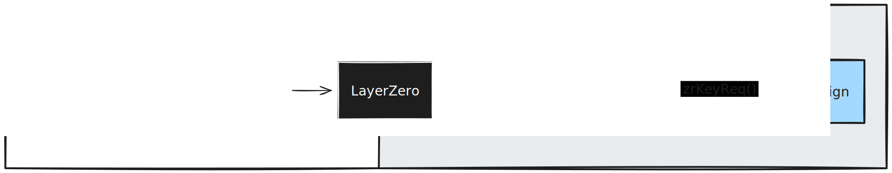

## Introduction
LayerZero provides a solution for general message passing between custom smart contracts on different chains, called OApps. 
Such OApps can be used to forward key and signature requests from networks where zrSign is not deployed (yet) and bundle resources for zrSign-based cross-chain dapps. 

For further information on OApp implementation we can recommend the [LayerZero Docs](https://docs.layerzero.network/v2/developers/evm/oapp/overview).


### zrSign OApp
The zrSign OApp has been developed to enhance accessibility and interaction with zrSign functionalities across LayerZero-supported blockchains. 

With this OApp, users can seamlessly interact with a zrSign contract deployed on an external blockchain, providing the flexibility to manage zrSign MPC keys from various external chains where the OApp is deployed. Requests are sent from the source OApp to the destination OApp, where the zrSign contract is located, allowing the contract to receive and execute these requests efficiently.


- **Outgoing OApp**: The "outgoing" OApp is the LZ OApp that a user interacts with on a chain where the zrSign contracts are not deployed. This OApp will send a request through the LayerZero stack to the "destination" OApp that then interacts with the zrSign contracts.

- **Destination OApp**: The "destination" OApp is the one receiving requests and forwarding it to the zrSign contract deployed on the same chain.



## Supported Networks
The list of supported networks will be expanded as we deploy the OApp (and zrSign contracts) to new networks.

### Outgoing OApps:
    - Ethereum Sepolia: [0x01edbc48854ebd3fcf8f8b9e411847c6d1990a35](https://sepolia.etherscan.io/address/0x01edbc48854ebd3fcf8f8b9e411847c6d1990a35)
### Destination OApps:
    - Polygon Amoy: [0xc0763f6501d331e92aeb54d2c5d76838fa26f1c5](https://amoy.polygonscan.com/address/0xc0763f6501d331e92aeb54d2c5d76838fa26f1c5)

## Functions

---

### `zrKeyReq`

#### Overview
`zrKeyReq` facilitates the request and generation of specific cryptographic keys that are managed by the user via the destination chain OApp (destination OApp). 

Once executed, the source OApp sends the supplied key request to a destination OApp that has been integrated with a zrSign contract. It then forwards the request to the zrSign contract and acts as a proxy between the user on the source chain and the zrSign contract on the destination chain.

One a key is generated, it is binded to the destination (destination) OApp and the user can interact with this new key via the specific OApp.

#### Parameters
- `walletTypeID (bytes32)`: Identifier for the wallet type involved in the signing.
    - EVM wallet Type: `0xe146c2986893c43af5ff396310220be92058fb9f4ce76b929b80ef0d5307100a`

#### Usage Example
```solidity
    function createWallet () public payable {
        bytes32 evmWalletTypeID = 0xe146c2986893c43af5ff396310220be92058fb9f4ce76b929b80ef0d5307100a;
        uint256 zrFee = oapp.calculateFee(evmWalletTypeID);

        oapp.reqZrKey{value: zrFee}(evmWalletTypeID);
    }
```

---

### `zrSigForTx`

#### Overview
`zrSignForTx` facilitates the signing of transactions, verifying the integrity and authenticity of transactional data as it moves or is utilized across different blockchain platforms. This function is essential for authorizing transactions, ensuring that they are conducted securely and in accordance with network and contract policies.

Once executed, the source OApp sends the supplied payload to a destination OApp that has been integrated with a zrSign contract. It then forwards the request to the zrSign contract and acts as a proxy between the user on the source chain and the zrSign contract on the destination chain.

#### Parameters
- `walletTypeID (bytes32)`: Identifier for the wallet type involved in the signing. At the moment the only supported wallet type is an EVM wallet type.
    - EVM wallet Type: `0xe146c2986893c43af5ff396310220be92058fb9f4ce76b929b80ef0d5307100a`
- `walletIndex (uint256)`: Index of the wallet which will be signing the hash.
- `dstChainID (bytes32)`: The destination chain ID where the signed transaction might be used or verified. The destination chain ID is represented as a keccak hash of the chain in CAIP-2 format. For example `keccak256(abi.encodePacked("eip155:11155111"))` is the ID for Ethereum Sepolia.
- `payload (bytes)`: Transaction data to be signed, provided as an array of bytes.
- `broadcast (bool)`: A boolean flag indicating whether the signed transaction should be broadcast immediately.

#### Usage Example
```solidity
    function sendRemoteTx() public payable {
        bytes32 evmWalletTypeID = 0xe146c2986893c43af5ff396310220be92058fb9f4ce76b929b80ef0d5307100a;
        uint256 walletIndex = 0;
        bytes32 destinationChainID = 0x58668d988d55d99e25d6bacd8ebdd4fd43f9afec7eb5550316efbaf05879b59b; // keccak256("eip155:168587773")
        bytes rlpTxPayload = 0xec0285012a05f2008303d090943ca69dc0824ff36b545ddb1b5e4bf13b17905421872386f26fc1000080808080;
        bool broadcast = true;

        uint256 zrFee = oapp.calculateFee(rlpTxPayload);

        oapp.reqZrSigForTx{value: zrFee}(
            evmWalletTypeID,
            walletIndex,
            destinationChainID,
            rlpTxPayload,
            broadcast
        );
    }
```
