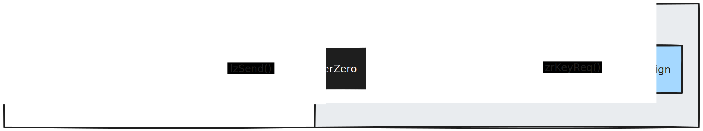

## Introduction
LayerZero provides a solution for general message passing between custom smart contracts on different chains, called OApps. 
Such OApps can be used to forward key and signature requests from networks where zrSign is not deployed (yet) and bundle resources for zrSign-based cross-chain dapps. 

For further information on OApp implementation we can recommend the [LayerZero Docs](https://docs.layerzero.network/v2/developers/evm/oapp/overview).


### zrSign OApp
The zrSign OApp has been developed to enhance accessibility and interaction with zrSign functionalities across LayerZero-supported blockchains. 

With this OApp, users can seamlessly interact with a zrSign contract deployed on an external blockchain, providing the flexibility to manage zrSign MPC keys from various external chains where the OApp is deployed. Requests are sent from the source OApp to the destination OApp, where the zrSign contract is located, allowing the contract to receive and execute these requests efficiently.

- **Outgoing OApp**: The "outgoing" OApp is the LZ OApp that a user interacts with on a chain where the zrSign contracts are not deployed. This OApp will send a request through the LayerZero stack to the "destination" OApp that then interacts with the zrSign contracts.

- **Destination OApp**: The "destination" OApp is the one receiving requests and forwarding it to the zrSign contract deployed on the same chain.



When using zrSign through an OApp, it is the destination OApp that becomes the access point to the generated wallets instead of your direct address. That means that if you use different destination OApps (which communicate with their own local zrSign implementations) you will control different wallets on each destination OApp. 

If you want to interact with an MPC key generated from an OApp, you will always have to go through the OApp. Future zrSign versions will introduce a shared state backed up by the zenrock chain which would allow you to control an MPC key from anywhere.

## Supported Networks
The list of supported networks will be expanded as we deploy the OApp (and zrSign contracts) to new networks.

### Outgoing & Desination OApps:

List of OApps that can both interact with external OApps and receive request which are forwarded to a local on-chain zrSign contract. 

| Network Name     | Chain Id | Address                                                                                                                       |
| ---------------- | -------- | ----------------------------------------------------------------------------------------------------------------------------- |
| Eth Sepolia      | 11155111 | [0x1106565715008703Ebcc55E5b0AdF1EBFE771685](https://sepolia.etherscan.io/address/0x1106565715008703Ebcc55E5b0AdF1EBFE771685) |
| Avalanche Fuji   | 43113    | [0x68C8A5a0895037bDB8E93DC30d1eCAc055eE9272](https://testnet.snowtrace.io/address/0x68C8A5a0895037bDB8E93DC30d1eCAc055eE9272) |
| Polygon Amoy     | 80002    | [0xC9706D80b1Bee144Ae5c5654FD5C658C3Bc6467E](https://amoy.polygonscan.com/address/0xC9706D80b1Bee144Ae5c5654FD5C658C3Bc6467E) |
| Arbitrum Sepolia | 421614   | [0xC9706D80b1Bee144Ae5c5654FD5C658C3Bc6467E](https://sepolia.arbiscan.io/address/0xC9706D80b1Bee144Ae5c5654FD5C658C3Bc6467E)  |
| Base Sepolia     | 84532    | [0xC9706D80b1Bee144Ae5c5654FD5C658C3Bc6467E](https://sepolia.basescan.org/address/0xC9706D80b1Bee144Ae5c5654FD5C658C3Bc6467E) |
| BSC Testnet      | 97       | [0xC9706D80b1Bee144Ae5c5654FD5C658C3Bc6467E](https://testnet.bscscan.com/address/0xC9706D80b1Bee144Ae5c5654FD5C658C3Bc6467E)  |

## Functions

---

### `zrKeyReq`

#### Overview
`zrKeyReq` facilitates the request and generation of specific cryptographic keys that are managed by the user via the destination chain OApp (destination OApp). 

Once executed, the source OApp sends the supplied key request to a destination OApp that has been integrated with a zrSign contract. It then forwards the request to the zrSign contract and acts as a proxy between the user on the source chain and the zrSign contract on the destination chain.

One a key is generated, it is binded to the destination (destination) OApp and the user can interact with this new key via the specific OApp.

#### Parameters
- `value` - native token value that you must provide in order to pay for LZ fees and transaction on destination chain. If you put more than required you will receive a refund for anything over the estimated cost.
- `walletTypeID (bytes32)`: Identifier for the wallet type involved in the signing.
    - EVM wallet Type: `0xe146c2986893c43af5ff396310220be92058fb9f4ce76b929b80ef0d5307100a`
- `zrOpts`: The `options` field is an enum for zrSign specifiying the different "modes" of key management. Currently we offer the following:
    - `1`: Simple key creation without any added features.
    - `2`: Added monitoring to the generated key which inform the off-chain services to keep track and monitor activity. This is useful for chains such as Bitcoin where you need.
- `eid`: The destination chain identifier for LayerZero. See the list of LZ endpoint ID's [here](https://docs.layerzero.network/v2/developers/evm/technical-reference/deployed-contracts).

#### Usage Example
```solidity
    function createWallet () public payable {
        bytes32 evmWalletTypeID = 0xe146c2986893c43af5ff396310220be92058fb9f4ce76b929b80ef0d5307100a;
        uint256 zrFee = oapp.calculateFee(evmWalletTypeID);

        oapp.reqZrKey{value: zrFee}(
            evmWalletTypeID, 
            1,              // no wallet monitoring
            40106           // Polygon Amoy endpoint ID
        );
    }
```

---

### `reqZrSendTx`

#### Overview
`reqZrSendTx` facilitates the signing of transactions, verifying the integrity and authenticity of transactional data as it moves or is utilized across different blockchain platforms. This function is essential for authorizing transactions, ensuring that they are conducted securely and in accordance with network and contract policies.

Once executed, the source OApp sends the supplied payload to a destination OApp that has been integrated with a zrSign contract. It then forwards the request to the zrSign contract and acts as a proxy between the user on the source chain and the zrSign contract on the destination chain.

#### Parameters
- `value` - native token value that you must provide in order to pay for LZ fees and transaction on destination chain. If you put more than required you will receive a refund for anything over the estimated cost.
- `walletTypeID (bytes32)`: Identifier for the wallet type involved in the signing. At the moment the only supported wallet type is an EVM wallet type.
    - EVM wallet Type: `0xe146c2986893c43af5ff396310220be92058fb9f4ce76b929b80ef0d5307100a`
- `walletIndex (uint256)`: Index of the wallet which will be signing the hash. You can fetch available indexes using `getWalletIndexes(owner)` and specifying the address of the wallet you use to interact with.
- `dstChainID (bytes32)`: The destination chain ID where the signed transaction might be used or verified. The destination chain ID is represented as a keccak hash of the chain in CAIP-2 format. For example `keccak256(abi.encodePacked("eip155:11155111"))` is the ID for Ethereum Sepolia.
- `payload (bytes)`: Transaction data to be signed, provided as an array of bytes.
- `eid`: The destination chain identifier for LayerZero. See the list of LZ endpoint ID's [here](https://docs.layerzero.network/v2/developers/evm/technical-reference/deployed-contracts).

#### Usage Example
```solidity
    function sendRemoteTx() public payable {
        bytes32 evmWalletTypeID = 0xe146c2986893c43af5ff396310220be92058fb9f4ce76b929b80ef0d5307100a;
        uint256 walletIndex = 0;
        bytes32 destinationChainID = 0x58668d988d55d99e25d6bacd8ebdd4fd43f9afec7eb5550316efbaf05879b59b; // keccak256("eip155:168587773")
        bytes rlpTxPayload = 0xec0285012a05f2008303d090943ca69dc0824ff36b545ddb1b5e4bf13b17905421872386f26fc1000080808080;
        bool broadcast = true;

        uint256 zrFee = oapp.calculateFee(rlpTxPayload);

        oapp.reqZrSigForTx{value: zrFee}(
            evmWalletTypeID,
            walletIndex,
            destinationChainID,     // zrSign destination chain for your transaction payload.
            rlpTxPayload,
            40106                   // endpoint ID destination for the LZ OApp.
        );
    }
```

--- 

### `getWalletIndexes`

#### Overview
`getWalletIndexes` allows the user to fetch all the wallet indexes owned by the particular user. This is a good way to distinguish which wallets controled by the OApp belong to which user.

> **NOTE** This function must be called at the OApp which is on the same chain as the zrSign contract. 

#### Parameters
- `owner (bytes32)`: A 0 padded address of the user's account which will be used to fetch the wallet indexes under his control.

#### Returns
- List of wallet indexes.

--- 

### `getWalletAddress`

#### Overview
`getWalletAddress` allows the user to retrieve the address of a wallet with specific index managed by the destination OApp.

> **NOTE** This function must be called at the OApp which is on the same chain as the zrSign contract. 

#### Parameters
- `walletIndex (uint256)`: The index of a user's wallet.

#### Returns
- Address of the wallet with the provided index.

--- 

### `addressToBytes32`

#### Overview
`addressToBytes32` is a utility function to help users convert an `address` to a `byte32` value used by some of the OApp's functions.

#### Parameters
- `walletIndex (address)`: The address that will be converted to a padded `byte32` type.

#### Returns
- Address padded with `0` value as a `byte32` type.


