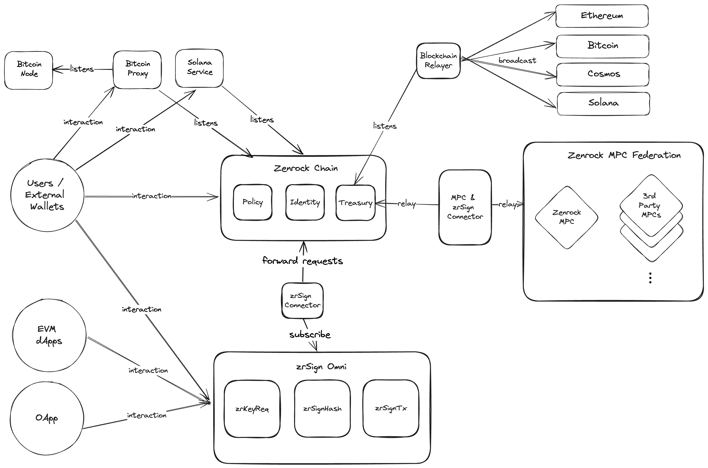

## Introduction

**zrSign Omni** is the next evolution step for zrSign to provide even better key and signature services. Building on the foundation of zrSign Direct, this version brings significant performance and architecture improvements, leveraging the capabilities of the Zenrock blockchain. 

### Zenrock Blockchain to Store Key and Signature Responses

Depending on which EVM network is used to interact with a zrSign Direct smart contract, the process of requesting and returning a key or signature can take up to a few minutes based on the underlying network's traffic and can cause significantly higher transaction fees. To solve this issue, zrSign Omni retains the same functions to request keys and signatures, but the responses are published on the Zenrock Blockchain instead of being stored on the zrSign smart contract. 
This approach comes with a series of benefits: 

1. ***Continuously fast and cheap processing of requests***: The responses appear on-chain within a few seconds and transaction fees can only be a fraction compared to the evm networks where zrSign is deployed.
2. ***Key harmonization across zrSign implementation***: zrSign Omni allows accessing keys generated through zrSign smart contracts deployed on other networks. 
3. ***Backwards compatibility***: The interfaces for zrSign smart contracts stay the same, which ensures stability of all dApps and systems interacting with zrSign smart contracts.
4. ***Leveraging Workspaces and Policies***: Developers have the possibility to access their key material also through Zenrock Chain directly, giving them direct access to some of the exclusive features on Zenrock such as workspace management and policies for request management.

### zrSign Omni Use Cases

The addition of zrChain-native policies enables zrSign developers to add conditions and different approvers to their signature requests without handling the authorization level within their smart contract. Thus, further opening the realm of possibilities for smart contracts on different chains to work with each other via zrChain. For example could a DEX aggregator collect approvals from signers on different networks to execute a swap on a remote DEX. In that case, the swap transaction is set on the request and gets immediately executed when the required members have approved the execution.

zrSign Omni also enables access to other networks like Bitcoin, Solana or other chains with more complex transaction structures. This also includes alternative zrSign implementations on any blockchain for example in a Rust version to deploy zrSign natively on other networks. 

### zrSign Omni System Architecture

The following diagram shows the system architecture of zrSign Omni in combination with the Zenrock blockchain. 

For zrSign Omni, the architecture of the zrSign smart contract only changes slightly. While the exposed methods stay the same, the responses are not stored on the zrSign smart contract directly, but instead forwarded on zrChain. 

On zrChain, we added a few new methods that help creating workspaces and keys through zrSign but were mostly able to go with existing processes and types in zrChain. This brings large benefits as the developer experience is largely harmonized between the zrChain-native CosmWasm smart contracts and those from the EVM. 
It's also worth mentioning that no additional relayer logic is required and the ones listening on Zenrock directly can be used to broadcast cross-chain messages. Instead of running multiple relayers, developers can now only run a single one which can be tailored to their custom address for example.