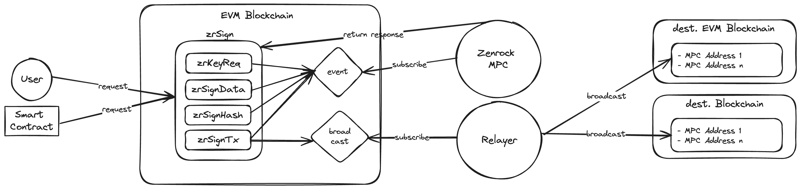

## Introduction

The **zrSign protocol** is a smart contract designed for providing key and signature services on various EVM blockchains.
Zenrock's dMPC will periodically query the zrSign smart contracts for pending requests and return the responses back to the smart contract. 
Stored in the smart contract, the public keys can be used as an externally owned account across the entire evm ecosystem.
zrSign specifies three different endpoints that allow you to request signatures for arbitrary data (**zrSignData**), 
blinded hashes (**zrSignHash**), and for transactions (**zrSignTx**) including a relayer service. 

The protocol is implemented as a set of smart contracts that can receive requests and the dMPC's responses.
A proxy smart contract allows for upgrading zrSign and the addition of new features. 

The next major version of zrSign - [zrSign v2](zrSignv2.md) - comes with additional performance- and architecture improvements leveraging the Zenrock blockchain! In this version, responses to request originating from zrSign smart contracts will get published on Zenrock directly, with additional features without changing the developer experience on the existing zrSign smart contracts and their consuming dapps. 

The following diagram shows the solution architecture of zrSign v1:

## Technical Implementation

zrSign is Zenrock's solution for cross-chain interoperability between blockchains. It allows you to manage funds and assets on different chains by interacting with zrSign Smart Contracts through a single instructor smart contract.

The zrSign system includes the following key elements:

- zrSign Smart Contracts
    zrSign Smart Contracts, written in Solidity, work on any EVM-compatible blockchain, facilitating key creation, signature requests, and transaction broadcasting on supported L1 chains. For a list of zrSign Smart Contracts on different chains, see ***[zrSign addresses](./addresses.md)***.

- Zenrock MPC network
    The Zenrock MPC network listens to events from the Smart Contract, generating and returning signatures. The MPC network consists of secure cloud-based MPC clusters.

- Cross-Chain Relayer
    Cross-chain interoperability is enabled by the Cross-Chain Relayer. It assembles unsigned transactions and their signature and relays them from the zrSign Smart Contract to the target blockchain, supporting various message types. Users have the option to run their own relayer for relaying messages across blockchains.

By combining zrSign Smart Contracts, the MPC network, and the relayer, zrSign ensures advanced programmable signing and seamless interaction between different blockchains.

